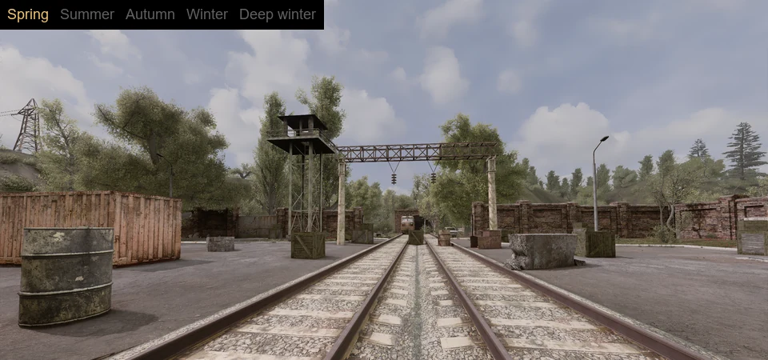
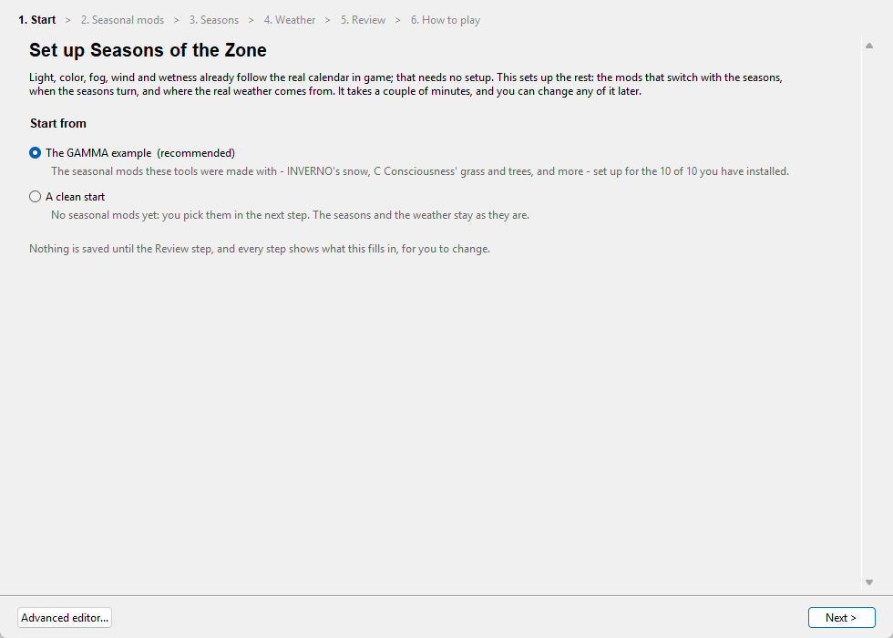
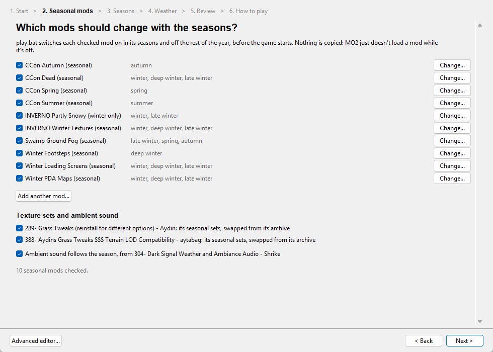
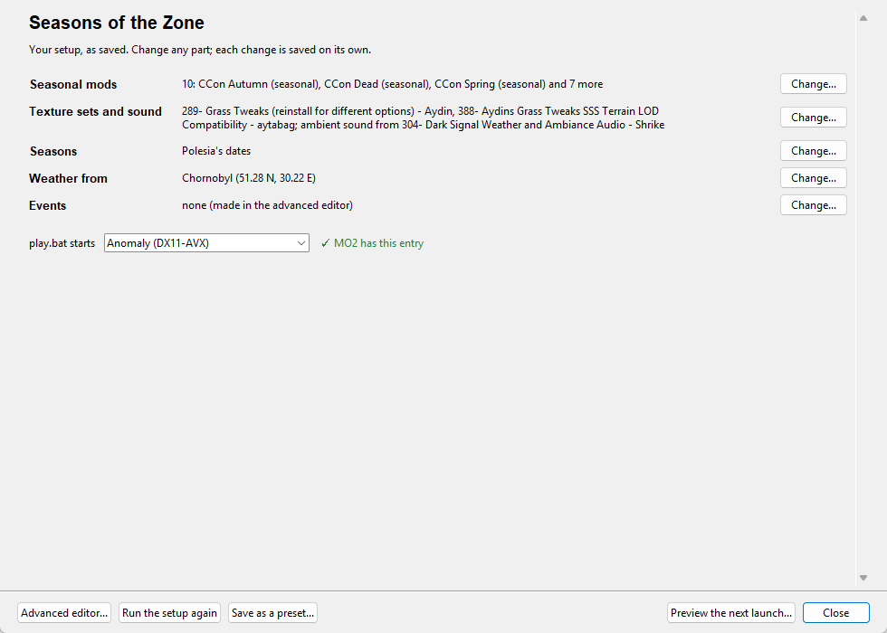
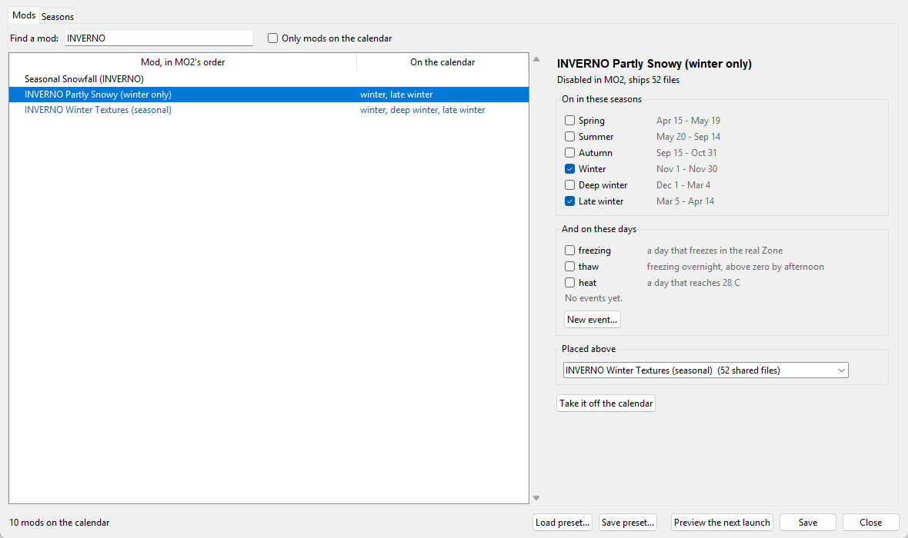
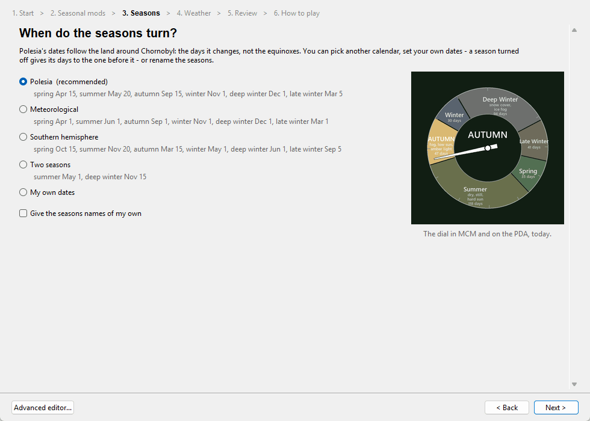
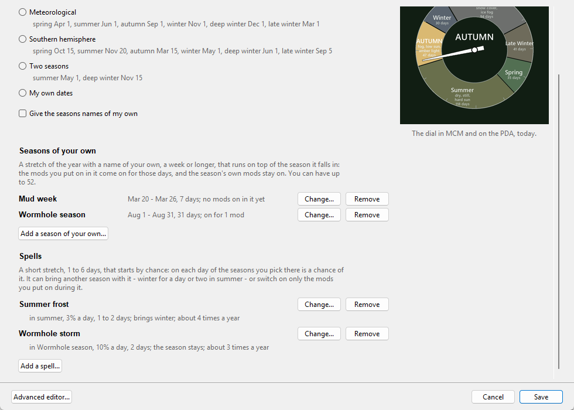
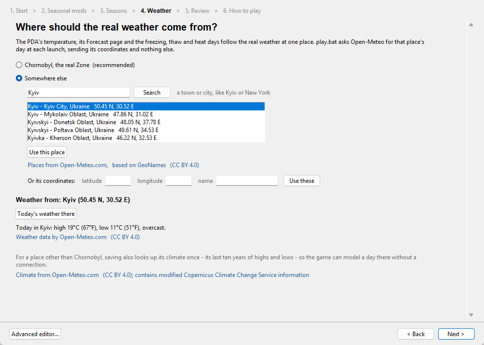

# Seasons of the Zone

**Point a mod at a stretch of the real calendar. It loads itself when that time of year
comes around, and unloads when it passes.**

The Zone follows the real-world calendar. Boot the game in late October, and it is autumn,
because Chornobyl is in autumn.



Light, color, fog, wind, wetness, snowfall, and ambient sound change with the date and
blend across each season boundary. Nothing to download beyond this mod, nothing to
configure.

That is the part that works out of the box. Underneath it is a scheduler, and the six
seasons are the calendar it ships with — see
**[the calendar underneath](#the-calendar-underneath)**.

*More of the interface: [docs/INTERFACE.md](docs/INTERFACE.md)*

---

## What it does

Twenty console values are set per season and blended across a 14-day window centered on
each boundary:

| Layer | What changes |
|---|---|
| Color and light | grade, saturation, gamma, exposure, sun lumscale, tonemap, sunshafts |
| Foliage | specular and sun-through-leaf (`ssfx_florafixes_1/2`) |
| Fog | `ssfx_fog`, `ssfx_fog_scattering` |
| Wind | `ssfx_wind_grass`, `ssfx_wind_trees` |
| Wetness | `ssfx_wetness_multiplier` — the thaw is the wettest, summer dries fast |

There is a year dial on the Main page and a PDA message when you load in.

**Six seasons.** Winter comes in three parts: in Polesia snow starts falling in November,
settles from December, and thaws through March into mud before anything turns green.

```
spring       Apr 15 - May 19    35 d   green-up
summer       May 20 - Sep 14   118 d   full foliage
autumn       Sep 15 - Oct 31    47 d   leaves turn; October is the peak
winter       Nov 01 - Nov 30    30 d   first snowfall, bare ground
winter_snow  Dec 01 - Mar 04    94 d   snow on the ground
late_winter  Mar 05 - Apr 14    41 d   the thaw: patchy snow, mud, bare trees
```

These are the dates the landscape changes, not the equinoxes, and they are only the
default. `configure.bat` moves the day any season starts, turns seasons off
and renames them, for a year of only summer and deep winter, say, or one on Ukraine's
meteorological dates. A season turned off gives its days to the one before it, and the
game, MCM and the dial all follow.

---

## The calendar underneath

Seasons of the Zone is two independent halves, and you can use either on its own.

| | What it is | Configurable? |
|---|---|---|
| **Seasonal atmosphere**, in game | Twenty console values blended across the date. Color, fog, wind, wetness. | Its strength, per layer, in MCM |
| **Seasonal mods**, at launch | A scheduler that decides which mods MO2 mounts today | Yes — this is the open half |

The seasonal-mods half has nothing seasonal about it. It maps a date to a set of names,
and mods declare which names they belong to. The six seasons are the default set. You can
add your own.

**Base periods** partition the year — exactly one is active on any date. **Events** overlay
whatever period they land in, so they add without displacing:

```python
# _tools/seasons_config.py
EVENTS = {
    "christmas": ((12, 24), (12, 26)),    # start, end - inclusive
    "halloween": ((10, 31), (10, 31)),    # a single day is fine
    "twelvetide": ((12, 26), (1, 6)),     # a window may wrap the year end
    "weekend": {"weekdays": ("sat", "sun")},   # or a rule: weekdays, days of the month...
}

TOGGLE_MODS = {
    "Christmas Lights": {"when": ("christmas",), "above": "..."},
}
```

On December 25th the game stages deep winter **and** Christmas. The snow does not go
anywhere — that is what "overlay" means, and it is the difference between a mod that
does seasons and one that can do occasions.

Nothing about a period has to be a texture. If MO2 can mount it as a folder, it can be
made seasonal: a gameplay patch, an audio set, a spawn table, a loading screen. The
texture packs are the obvious first use.

```python
PERIODS = {                    # extra base periods, alongside the seasons
    "high_summer": (7, 1),     # runs until the next period starts
}
```

**Seasons of your own** are named stretches of the year, a week or longer - up to 52 of
them - that run on top of the season they fall in, as events do. A wormhole anomaly mod
made the usual way can come on for "Wormhole season" in August and leave summer's mods
where they are.

**Spells** come by chance. On each day of the seasons a spell names there is a chance it
starts, and then it runs 1 to 6 days. A spell can bring another season with it: a spell
of winter in summer switches the winter mods on and summer's off, and the game's light and
weather follow it until it ends. The date decides, so every launch that day agrees.

```python
OWN_SEASONS = {
    "Wormhole season": ((8, 1), (8, 31)),        # first and last day, a week or longer
}
SPELLS = {
    # in summer, a 3% chance each day of a day or two of winter
    "Summer frost": {"in": ("summer",), "chance": 3, "days": (1, 2), "as": "winter"},
}
```

Full reference: **[docs/SCHEDULING.md](docs/SCHEDULING.md)**.

---

## Six days the Zone marks

Six fixed dates ship with the mod, each laid over whatever season is running rather than
replacing it. April 26 is still spring underneath; December 14 is still deep winter.

Two are **remembrance days** and the Zone goes quiet:

| | |
|---|---|
| **April 26** | International Chernobyl Disaster Remembrance Day |
| **December 14** | Liquidators' Day |

The weather is held clear and the PDA carries the day. No reward, no drop, no map marker.

Four are **anniversaries** — the release dates of the mainline games — and they pull the
other way. The weather is pushed to storm and a few extra artifacts are seeded on each
level you visit, roughly zero to five, once per level per day.

| | |
|---|---|
| **March 20** | Shadow of Chernobyl |
| **August 22** | Clear Sky |
| **October 2** | Call of Pripyat |
| **November 20** | Heart of Chornobyl |

Each day carries its own PDA traffic — an opening transmission shortly after you load in,
then more at intervals of eight to twenty minutes, drawn from that day's pool. 108 lines
in all, across eight voices, each signed and carrying that speaker's portrait: Barman,
Sidorovich, Owl, Beard, Sakharov, Forester, Nimble, and an unnamed guide.

The anniversary lines count the years **in-world**, from the in-game clock against the
year each game is set in — Shadow of Chernobyl in May 2012, Clear Sky in 2011, Call of
Pripyat in August 2012. A fresh save hears *"6 years since Operation Fairway"*, and the
count advances as the save ages. Heart of Chornobyl is set in 2021-22, still ahead of
Anomaly's own calendar, so it carries no count at all.

Five switches on the MCM Main page turn any of it off. The artifact seed is the only part
of the mod that writes to your save.

---

## Requirements

- S.T.A.L.K.E.R. Anomaly with **G.A.M.M.A.**, through **Mod Organizer 2** (portable)
- **Screen Space Shaders** and the **Modded Exes** DX11 build GAMMA ships with it. Nine of
  the twenty values are SSS's own; an older exe does not have them, and the mod says so in
  the log.
- **MCM**
- **Mod App Creator**, for the PDA app. MCM's Main page shows in red if it's missing.
- **Python 3**, for `play.bat` and `configure.bat` only. The python.org installer is
  enough.
- For some things only: `py -m pip install py7zr` to open a `.7z` - an optional `LAYOUT`
  texture set's, or a mod's installed from the setup - and `rarfile` plus WinRAR or 7-Zip
  for a `.rar`; `py -m pip install pillow` to draw the year dial for a calendar of your
  own.

### Outside GAMMA

| | Plain Anomaly | Anomaly + Modded Exes |
|---|---|---|
| Color and light | yes | yes |
| Foliage, fog, wind, wetness | no | with Screen Space Shaders |
| The six marked days | yes | yes |
| The read API for other mods | yes | yes |
| The Seasons PDA app | no | with Mod App Creator |
| Texture and sound staging | with MO2 portable and Python | same |

- Foliage, fog, wind, and wetness use Screen Space Shaders' engine commands, which only exist
  in Modded Exes. Without them the mod logs it once and skips those layers.
- The PDA app needs Mod App Creator, which requires Modded Exes.
- Staging works with any MO2 portable install. It reads the game path and profile from
  `ModOrganizer.ini`.
- The anniversary artifacts need Dynamic Anomalies Overhaul.

Tested on Anomaly 1.5.3 with Modded Exes, MCM and Mod App Creator, and nothing else from
GAMMA: the seasonal atmosphere, the marked days, the PDA app and MCM all work, and the forecast
reads the base game's weather. Plain Anomaly without Modded Exes hasn't been run; its column
follows from what its engine lacks.

---

## Install

1. In MO2, use **Install a new mod from archive** on the release zip, then enable the mod.
   That's everything in game: the light and weather, the marked days, the PDA app and MCM.
2. For real-world temperatures and seasonal mods: in MO2, right-click the mod, choose
   **Open in Explorer**, and double-click `configure.bat` there. It puts `play.bat`,
   `configure.bat` and the `_tools` folder in your GAMMA folder, next to
   `ModOrganizer.exe`, and then walks you through the setup, a step at a time
   ([below](#making-a-mod-seasonal)). Its last step checks which MO2 entry `play.bat`
   starts.
3. Close MO2, and start the game with `play.bat` in your GAMMA folder. It opens MO2
   itself; it can't switch mods while MO2 is already open. Starting from MO2 still works
   ([below](#why-a-launcher)): `play.bat` is what moves the seasonal mods along with the
   date.

`play.bat` fetches the day's real weather - Chornobyl's, or a place you pick in the
setup - checks the date, switches the seasonal mods, and starts the game. Most days it changes nothing. Paths come from `ModOrganizer.ini`, so the
drive, game folder and profile are read rather than assumed. To see what the next launch
will do without starting anything, use **Preview the next launch** in `configure.bat`, or
run `py _tools\season.py status` in the GAMMA folder.

**Updating:** install the new zip over the old one and choose **Replace**, then open
`configure.bat` from the mod's folder again, as in step 2. It updates the tools in your
GAMMA folder and keeps your setup and the MO2 entry `play.bat` starts. Versions before
1.7.0 were installed by copying the `mods/Seasons of the Zone` folder: name the new install
`Seasons of the Zone` so it replaces that copy.

**Removing it:** switch it off in MCM first (this restores the color grade to neutral),
then disable the mod. Seasonal mods stay as `play.bat` last left them; enable or disable
them in MO2 as you like. If you applied the snowfall patch, `--revert` it too; without the
mod, the addon snows whenever the weather says so.

**While a layer is on**, SSS's own MCM sliders for that layer, and the vanilla sunshafts
and gamma sliders, are overridden within five seconds. Switch the layer off to tune them
yourself.

---

## Why a launcher

The seasonal atmosphere changes in game, immediately. Terrain and grass textures can't: X-Ray
loads them from MO2's virtual file system when a level loads and keeps them for the
session. So seasonal mods have to be switched before the game starts, and that is what
`play.bat` does.

It isn't needed to play. Started from MO2, everything else goes on by the date: the light
and weather, the marked days, the PDA and MCM, and the API other mods read. What
`play.bat` switched stays as it last left it until it runs again. The weather stays real
for as long as the forecast it last fetched reaches, 16 days; after that, and with no
connection at all, the temperature comes from the place's climate, so nothing that reads
it goes without. If you have no seasonal mods, launch however you like.

---

## The MCM pages

**Mod Configuration Menu → Seasons of the Zone** has a Main page, then one for each
season your calendar has on: seven pages with the default calendar.

- **Main** — the year dial and today's date; the master switch; season (automatic, or
  pin one — a pin also decides what is staged at the next launch); transition length (0 for a hard switch on the boundary date, 14 by default);
  intensity (0 is GAMMA's stock look, 1 the full season); one switch per layer: color,
  foliage, fog, wind, and wetness; the two launch-time switches, for textures and
  ambient sound; the PDA message.
- **Spring, Summer, Autumn, Winter, Deep winter, Late winter** — that season's color
  grade preset, a read-out of the values it resolves to, and a checkbox for each
  seasonal mod on in it. The pages take your own season names.

---

## Making a mod seasonal

Any installed mod can follow the calendar. You do not modify it; you say when it belongs.
A seasonal mod is switched on by `play.bat` in the seasons, events and weather you pick,
and off the rest of the year.

**With `configure.bat`.** The first time, it walks you through the setup in six steps:

1. **Start** from the GAMMA example - the seasonal mods these tools were made with, for the
   ones you have installed - from a preset of your own, or from nothing.
2. **Seasonal mods**: a checklist. **Change...** sets when one is on; **Add another
   mod...** makes any other mod seasonal; **Install one from an archive...** installs a
   mod you've downloaded and makes it seasonal in one go, with its installer's options and
   any fix file from its author. Archives in your GAMMA and downloads folders whose names
   say a season are listed there, ready to install. When two seasonal mods on at the same
   time ship the same files, it asks whose the game should use.
3. **Seasons**: Polesia's dates, another calendar, or your own, with the year dial as the
   game will draw it, and names of your own if you like. Here too you add seasons of your
   own and spells.
4. **Weather**: Chornobyl, or a place you look up.
5. **Review**: what `play.bat` will switch today. Nothing is written until you save here.
6. **How to play**: which MO2 entry `play.bat` starts, and how to start the game.





After that, `configure.bat` opens to a summary of your setup, with a **Change** button for
each part, **Run the setup again**, and **Preview the next launch**, which shows what
`play.bat` would switch.



Everything the steps leave out - events, and which mod wins over which - is in the
**Advanced editor**, a button away on every page. It works out the mod each seasonal mod
has to win over - where two mods ship the same file, MO2 uses the one lower in its list -
and checks the file before it writes it.



The same from a command prompt in your GAMMA folder, which is handy when someone is
helping you (use `python` in place of `py` if that is how your Python starts):

```
py _tools\configure.py add "INVERNO Winter Textures" --when winter "deep winter"
py _tools\configure.py event christmas 12-24 12-26
py _tools\configure.py season "Wormhole season" 08-01 08-31
py _tools\configure.py spell "Summer frost" --in summer --chance 3 --days 1 2 --as winter
py _tools\configure.py list
```

`py _tools\configure.py --help` lists every command.

The **Seasons** step sets the calendar itself: the day each season starts, which seasons
are on, and what each is called, with the dial the game will draw for it.
`py _tools\configure.py calendar` shows it, and
`py _tools\configure.py calendar summer=5-1 "deep winter=11-15" --only` makes a two-season
year.



Further down the same step, **Add a season of your own...** and **Add a spell...**, with
how often each spell comes on average.



The **Weather** step picks where the real weather comes from: Chornobyl, or a town you look
up by name. The PDA's temperature, its Forecast page and the freezing, thaw and heat days
follow the weather there.



**Presets** keep a setup under a name - the calendar and season names, the events, the
seasonal mods, texture sets and sound - to load again, or to share. The setup's first
step offers yours to start from, and the Review step saves nothing until you say. Load
one made on another install and the mods you don't have are left out. Four calendars come with the
tool, and a **GAMMA example**: the seasonal mods these tools were made with, set up for the
GAMMA mods you have installed. Its texture sets need `py7zr` (see
[Requirements](#requirements)), and it names mods by their folder names in GAMMA, so a mod
you have renamed is left out.


**By hand.** Both write `_tools\seasons_config.py`, which you can also edit yourself:

```python
TOGGLE_MODS = {
    "INVERNO Winter Textures": {                  # folder name, exactly as MO2 shows it
        "when": ("winter", "winter_snow", "late_winter"),   # seasons, events or weather
        "above": "388- Aydins Grass Tweaks SSS Terrain LOD Compatibility - aytabag",
    },                                            # ^ the mod it wins over
}
```

`when` takes any mix of seasons, events and weather. In the file, deep winter is
`winter_snow` and late winter is `late_winter`. `seasons` is the original spelling of the
same key and still works, so nothing written for an earlier version needs editing.

Start the game with `play.bat`. The mod is enabled in November and disabled in mid-April,
and appears on the Winter, Deep winter and Late winter pages with its file count and size.
Nothing is copied — MO2 stops mounting the folder — so an 11 GB texture set costs nothing
to switch.

To stop switching a mod, uncheck it on the Seasonal mods step, or run
`py _tools\configure.py remove "<mod>"`. `play.bat` then leaves it as it is in MO2. Every
save keeps the previous file as `seasons_config.py.bak`, to go back to.


*The packs shown are third-party texture mods, not included here.*

### Which mod it wins over (`above`)

`above` is the mod yours wins over. MO2 gives a shared file to the enabled mod with the
highest priority - the one lowest in its left pane - and if another mod wins over yours on
a file, yours loses it and nothing tells you. `configure.bat` picks `above` from the files
the mods share. To check by hand, pick a file your mod ships and ask, naming your mod with
`--for`:

```
py _tools\season.py whowins textures/map/map_escape.dds --for "Winter PDA Maps (seasonal)"
```

```
    line   190  disabled  Winter PDA Maps (seasonal)             2097280 B   <-- yours
    line   539  enabled   358- Global Map Rework - DeadEnvoy     8388736 B   <-- yours has to win over this one
    line   862  enabled   26- High Res PDA Maps - Bazingarrey    8388736 B

  Make Winter PDA Maps (seasonal) win over:  358- Global Map Rework - DeadEnvoy
```

Use that name. If no other mod ships the file, any position works. `--for` keeps your mod
out of the answer, which matters when it is enabled at the top of the list, where MO2 puts
a fresh install.

### Mods that work well this way

| Mod | Seasons | Notes |
|---|---|---|
| Project I.N.V.E.R.N.O — winter textures | `winter`, `winter_snow`, `late_winter` | Terrain, flora and levels. Must win over your grass mod and Atmospherics/SSS; it carries its own shader headers. |
| I.N.V.E.R.N.O — "Partly snowy" ground detail | `winter`, `late_winter` | Patchy ground while the snow arrives and while it melts. Wins over the base INVERNO. |
| C Consciousness Grass & Trees | `spring` / `summer` / `autumn` / the three winters | Four sets, one entry each; the Dead set covers all three winters, under the snow and through the thaw. Its grass placement does not change with the season, so that part stays mounted year-round and is not a seasonal entry. |
| Grass and Trees by PanceRide | `summer` / `autumn` | Matching Summer and Autumn editions; two entries, one per season. |
| Winter loading screens | `winter`, `winter_snow`, `late_winter` | Wins over your loading-screen mod. |
| Winter PDA maps | `winter`, `winter_snow`, `late_winter` | Wins over every mod that ships map textures, INVERNO included. |
| Swamp / ground fog | `late_winter`, `spring`, `autumn` | |

If MO2 can mount it as a folder, it can be seasonal: footstep audio, menu art, a flower pack.

### `LAYOUT`

Some mods ship one folder per season inside a single archive (Aydin's Grass Tweaks).
`LAYOUT` restages the mod's contents from the archive when the season changes. Gigabytes
move, so use `TOGGLE_MODS` wherever a mod can be switched off instead.

`_tools\seasons_config.example.py` is the setup these tools were made on - its seasonal
mods, texture sets and sound - with every table described;
[docs/CONFIGURING.md](docs/CONFIGURING.md) is the field reference.

---

## Optional: seasonal ambient sound

Point `SOUND_SRC` at the ambience mod that wins your
`configs/environment/ambients/presets/` files. Its sound channels are then gated per
season, so each of the six sounds different: spring keeps the dawn chorus and loses the
crickets, summer has everything, autumn loses the daytime insects but keeps crickets
calling until the frost, and the winters lose the insects entirely. Deep winter loses
the daytime birds too, and the thaw brings the marsh birds back before any insect. Wind
and storms are untouched. Crows and owls stay all year.

The gated presets are generated from your own files at launch. Switchable on the Main page.

---

## Optional: seasonal snowfall

Project I.N.V.E.R.N.O's snowfall addon plays its particles off the weather alone, so it
snows in September. `patches/apply_seasonal_snowfall.py` adds a seasonal layer: snow only
in the three winters, lighter in the first and the last, seeds in spring, leaves in autumn,
dust in the dry months, mist in the thaw.

It edits your own copy of the addon; none of INVERNO's code is shipped here. Install the
standalone "Snowfall (light + Dynamic Fog)" addon, then, in your GAMMA folder:

```
py "mods\Seasons of the Zone\patches\apply_seasonal_snowfall.py"
```

It finds the script under `mods/`, backs it up to `yawm_snowfall.script.orig`, and inserts
the layer. `--revert` restores the backup. Run it again after updating this mod to bring
the layer up to date; on a current copy it does nothing. It refuses a file that does not
look like INVERNO's script.

The addon also ships an old `level_weathers.script`. Remove it: the patcher warns, and
`--disable-weathers` renames it. See [docs/LOAD-ORDER.md](docs/LOAD-ORDER.md).

---

## Optional: color grade presets

Each season's color grade can come from a `cfg_load` preset instead of the mod's season
table: pick one on that season's own page. The dropdown lists every preset in the game's
`appdata/` — Atmospherics' `Atmos_Cold`, `Atmos_Neutral` and `Atmos_Warm`, and any you have
tuned yourself — plus the mod's own `Seasons_Spring`, `Seasons_Summer`, `Seasons_Autumn`,
`Seasons_Winter`, `Seasons_DeepWinter`, `Seasons_LateWinter` and `Seasons_Neutral`.
`play.bat` copies those seven into `appdata/` beside the others, so you can `cfg_load` or
edit them too. Only the grade changes; fog, wind and wetness stay with the season table.

---

## Load order

Seasons of the Zone can go anywhere in MO2. No other mod ships any of its files, and
script order comes from the engine's directory listing (hence the `zzz_` name), not from
priority. It only has to be enabled. What does need placing:

- the seasonal mods — `play.bat` keeps each just below the mod it wins over in MO2's list
  at every launch, and `py _tools\season.py status` reports any other mod that would still
  win its files;
- INVERNO's snowfall addon — remove `level_weathers.script` from it;
- never enable the old Season Flora prototype alongside this.

A GAMMA launcher **Update** drops this mod and its companions from the load order.
Details and recovery: [docs/LOAD-ORDER.md](docs/LOAD-ORDER.md).

---

## Documentation

| | |
|---|---|
| [docs/SCHEDULING.md](docs/SCHEDULING.md) | The calendar: base periods, seasons of your own, spells, events, and recipes |
| [docs/TRANSLATING.md](docs/TRANSLATING.md) | Translating the tools and the game's text into another language |
| [docs/INTERFACE.md](docs/INTERFACE.md) | The MCM pages and the Seasons app in the PDA |
| [docs/API.md](docs/API.md) | The read API other mods hook into: temperature, weather, the next emission |
| [docs/WEARABLE-DEVICES.md](docs/WEARABLE-DEVICES.md) | A blowout warning for Wearable Devices: the code, and why it cannot break that mod |
| [docs/CONFIGURING.md](docs/CONFIGURING.md) | Making mods seasonal: the window, the commands, the file, troubleshooting |
| [docs/HOW-IT-WORKS.md](docs/HOW-IT-WORKS.md) | The calendar, the blend, the values, the MO2 rule |
| [docs/LOAD-ORDER.md](docs/LOAD-ORDER.md) | Where everything sits, what must not be enabled together, recovering from a GAMMA update |
| [CHANGELOG.md](CHANGELOG.md) | Version history |

---

## Credits

Seasons of the Zone is by **Devin Horowitz**, MIT license.

Weather data by [Open-Meteo.com](https://open-meteo.com/), under
[CC BY 4.0](https://creativecommons.org/licenses/by/4.0/): the day's high and low, and, for
a place you pick, its climate over the last ten years, which contains modified Copernicus
Climate Change Service information. The place search is based on
[GeoNames](https://www.geonames.org/) (CC BY 4.0). The game moves the temperature with its
own sky, so what the PDA shows is Open-Meteo's, changed.

No third-party assets are included. The texture, snowfall and soundscape layers read mods
you install yourself, and the configuration ships empty. INVERNO's `yawm_snowfall.script`
(Yet Another Winter Mod by Daedalus-Prime, refactored by demonized, edited by Fabio Conte;
particles by S.e.m.i.t.o.n.e.) is not shipped in any form; the patcher carries only the
seasonal layer.

Built on **Screen Space Shaders** by Ascii1457 and **G.A.M.M.A.** by Grokitach. Seasonal
texture sets by the I.N.V.E.R.N.O, C Consciousness, PanceRide and Aydin authors.
