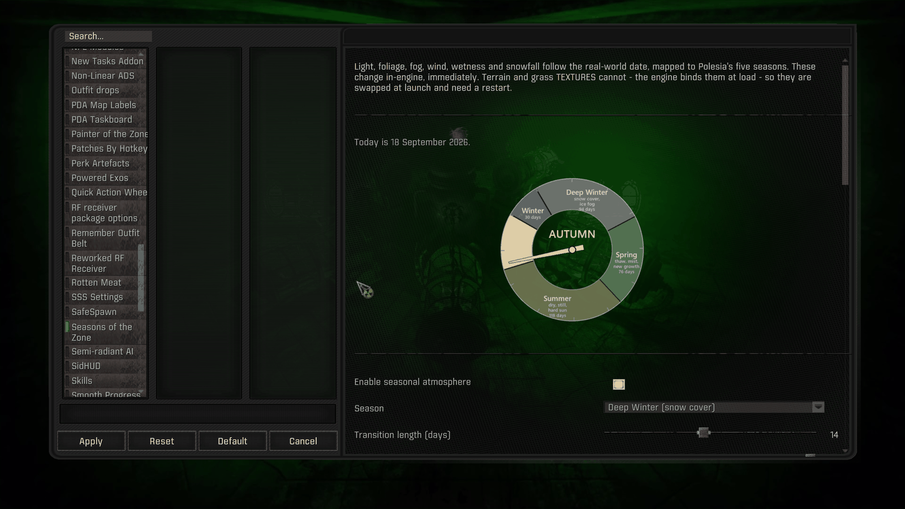
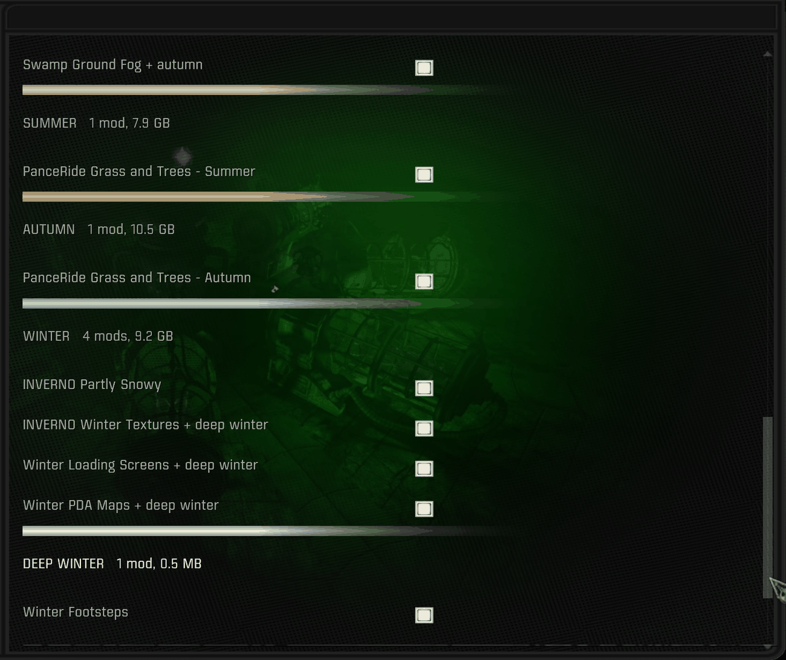

# Seasons of the Zone

The Zone follows the real-world calendar. Boot the game in late October, and it is autumn,
because Chornobyl is in autumn.

Light, color, fog, wind, wetness, snowfall, and ambient sound all shift with the date and
blend across each season boundary. Nothing to download beyond this mod, and nothing to
configure — it works the moment it is enabled.



*More of the interface: [docs/INTERFACE.md](docs/INTERFACE.md)*

---

## What it actually does

Twenty engine uniforms are driven per season and interpolated across a 14-day window
centered on each boundary, so seasons arrive gradually rather than switching overnight:

| Layer | What changes |
|---|---|
| Color and light | grade, saturation, gamma, exposure, sun lumscale, tonemap, sunshafts |
| Foliage | `ssfx_florafixes_1/2` — specular and sun-through-leaf |
| Fog | `ssfx_fog`, `ssfx_fog_scattering` |
| Wind | `ssfx_wind_grass`, `ssfx_wind_trees` |
| Wetness | `ssfx_wetness_multiplier` — spring stays wet from the thaw, summer dries fast |

Plus a year dial in the MCM page showing where today sits, and a PDA report on loading in.

**Five seasons** Winter is split, because in Polesia snow arrives from late
October but cover only holds from about December through March, and the thaw is what makes
spring wet. One 110-day winter forced a choice between snow two months too early and bare
ground through February.

```
spring       Mar 05 - May 19    76 d   thaw and meltwater, then green-up
summer       May 20 - Sep 14   118 d   full foliage
autumn       Sep 15 - Oct 31    47 d   the turn; October is peak golden autumn
winter       Nov 01 - Nov 30    30 d   first snowfall, ground not yet covered
winter_snow  Dec 01 - Mar 04    94 d   snow lies on the ground
```

The dates are phenological, not the astronomical
equinoxes, and deliberately lopsided. `--mapping met` switches to Ukraine's
hydrometeorological convention if you prefer round numbers.

---

## Requirements

- S.T.A.L.K.E.R. Anomaly with **G.A.M.M.A.**, run through **Mod Organizer 2** (portable)
- **Screen Space Shaders** — the uniforms above are SSS's — and the **Modded Exes** engine
  build GAMMA ships it with, on **DX11**. An older exe does not know the `ssfx_` commands;
  the mod says so in the log rather than guessing.
- **MCM** for the settings page
- **Python 3**, only for the launcher. The python.org installer is enough; `play.bat`
  finds it through the `py` launcher.
- For the optional `LAYOUT` texture layer only: `python -m pip install py7zr` (and
  `rarfile`, plus WinRAR or 7-Zip, for `.rar` archives). Nothing else needs a package.

---

## Install

1. Copy the **inner** `mods/Seasons of the Zone` folder into your `mods/` — so that
   `mods/Seasons of the Zone/gamedata` exists — and **enable it** in MO2. (Do not use
   MO2's *Install from archive* on the zip; it holds the tools too.)
2. Copy `_tools/` and `play.bat` into your GAMMA root (beside `ModOrganizer.exe`).
3. Open `play.bat` and check `SHORTCUT=` names the Anomaly entry you launch from MO2
   (default `Anomaly (DX11-AVX)`; it refuses to start a name MO2 does not have).
4. Launch with **`play.bat`** instead of MO2 from now on.

That is the whole installation. `play.bat` checks the date, stages anything that needs
staging, and starts the game. It is a no-op on most days and only does real work about five
times a year.

Paths are detected from `ModOrganizer.ini`, so the drive letter, the game folder name and
the selected profile are all read rather than assumed.

**Removing it:** switch it off in MCM first, then disable the mod. Switching it off hands
the colour grade back at its neutral values; pulling the mod while it is on leaves the
console graded to whatever season was running until something else sets those values. If
you applied the snowfall patch, `--revert` it too — with the mod gone, the gate falls back
to snowing whenever the weather says so.

**While a layer is on**, SSS's own MCM sliders for that layer (fog, wind, flora fixes,
wetness) and the vanilla sunshafts and gamma sliders are overridden within five seconds.
Switch the layer off to tune them yourself.

---

## Why a launcher at all

Everything above changes **in-engine, immediately**. Terrain and grass **textures cannot**:
X-Ray binds them out of MO2's virtual file system at level load and freezes them for the
session. There is no runtime rebind — the only `reload_textures()` in the whole install
works by calling `ChangeLevel()`. So the texture layer has to be decided *before* the game
starts, which is what `play.bat` is for.

If you never use the optional texture layer, you can launch however you like; the in-engine
layer follows the calendar on its own.

---

## The MCM page

Everything is adjustable in **Mod Configuration Menu → Seasons of the Zone**:

- **Season** — Automatic, or pin one for screenshots
- **Transition length** — 0 for a hard switch on the boundary date, 14 by default
- **Intensity** — 0 renders vanilla, 1 the full season
- Per-layer switches for colour, foliage, fog, wind and wetness
- The year dial, the live calendar, and the PDA report

---

## Piggybacking other mods onto the seasons

Any mod you already have can be made seasonal. You do not modify it, repackage it, or ask
its author for anything — you name it in `_tools/seasons_config.py` and it switches on and
off with the calendar.

### The short version

```python
TOGGLE_MODS = {
    "INVERNO Winter Textures": {                  # folder name, exactly as MO2 shows it
        "seasons": ("winter", "winter_snow"),     # any of the five
        "above": "388- Aydins Grass Tweaks SSS Terrain LOD Compatibility - aytabag",
    },
}
```

Three fields. Relaunch. It now mounts in November and unmounts in March, and appears in the
MCM page by itself under a WINTER heading with its file count and size.

Nothing is copied — MO2 simply stops mounting the folder — so an 11 GB winter texture set
costs nothing to swap.



*Mods named in the config appear grouped by season, with their size, each
independently switchable. The packs shown are third-party texture mods, not
included here.*

### Getting `above` right, which is the only hard part

`above` names the mod yours must outrank. MO2 gives a shared file to the **highest enabled
mod that ships it**, so if something above yours also ships that file, your mod loses and
*nothing tells you*: the flag flips exactly as asked, the tool reports success, and the
screen does not change.

So ask rather than guess. Pick a file your mod ships and run:

```
python _tools/season.py whowins textures/map/map_escape.dds
```

```
  line   522  [-]  Winter PDA Maps (seasonal)                    2097280 B
  line   523  [+]  358- Global Map Rework - DeadEnvoy            8388736 B   <-- WINS
  line   840  [+]  26- High Res PDA Maps - Bazingarrey           8388736 B

  Put your seasonal mod ABOVE:  358- Global Map Rework - DeadEnvoy
```

Copy that name into `above`. If it says the base game provides the file, any placement wins
and you can anchor on anything stable.

### Mods that work well this way

| Mod | Seasons | Notes |
|---|---|---|
| Project I.N.V.E.R.N.O — winter textures | `winter`, `winter_snow` | The big one. Terrain, flora and levels. Must outrank your grass mod *and* Atmospherics/SSS, since it carries its own shader headers. |
| I.N.V.E.R.N.O — "Partly snowy" ground detail | `winter` only | What separates the two winters: patchy ground as snow arrives, full cover once it holds. Sits above the base INVERNO. |
| Grass and Trees by PanceRide | `summer` / `autumn` | Ships matching Summer and Autumn editions — one mod repainted, so the Zone keeps its shape across the boundary. Two entries, one per season. |
| Winter loading screens | `winter`, `winter_snow` | Above whichever loading-screen mod you run. |
| Winter PDA maps | `winter`, `winter_snow` | Above **both** map mods if you have two — see the `whowins` example. |
| Swamp / ground fog | `spring`, `autumn` | Shoulder seasons: thaw damp, then cool nights over warm water. |

Anything with a seasonal flavor works — snow footstep audio, winter main-menu art, a
spring flower pack. If MO2 can mount it as a folder, it can be seasonal.

### When to use `LAYOUT` instead

`TOGGLE_MODS` switches a whole mod on or off. A few mods instead ship **one folder per
season inside a single archive** — Aydin's Grass Tweaks is the common example. For those,
`LAYOUT` restages the mod's *contents* from the original archive on a season change. It is
the expensive mechanism, since gigabytes actually move, so prefer `TOGGLE_MODS` whenever a
mod can simply be switched off.

See `seasons_config.example.py` for a complete working configuration.

---

## Optional: seasonal ambient sound

Insects under snow are wrong. Point `SOUND_SRC` at whichever ambience mod wins your
`configs/environment/ambients/presets/` files and the sound channels are gated per season —
insects and daytime birds silenced in deep winter, marsh life fading in autumn, wind and
storms untouched. Crows and owls are kept year-round on purpose.

Generated from your own files at launch, so it adapts to whatever soundscape you run rather
than replacing it. Switchable from the same MCM page.

---

## Optional: seasonal snowfall

Project I.N.V.E.R.N.O's snowfall addon plays its particles off the weather alone, with no
notion of season — so in an install that runs all year it snows in September the moment
the right weather comes round. `patches/apply_seasonal_snowfall.py` gates it: snow only in
the two winters and thinner in the first of them, seeds in spring, leaves in autumn, dust
in the dry months, each easing in and out across the turn.

It is a **patcher, not a patched file**. The script it modifies is not mine, so nothing
of it is redistributed here — you install INVERNO's snowfall addon yourself, then run:

```
python patches/apply_seasonal_snowfall.py
```

It finds your copy under `mods/`, backs it up to `yawm_snowfall.script.orig`, and inserts
the seasonal layer. `--revert` puts the original back. It refuses to touch a file that
does not look like INVERNO's script, and running it twice is a no-op.

The inserted code reads this mod's own `snow_factor()` and `season_mix()`, so it is a
component of the system; with Seasons of the Zone absent the gate is inert and the addon
behaves exactly as shipped.

---

## Load order

Seasons of the Zone can sit **anywhere** in MO2. No other mod ships any of its 44 files,
and script order is decided by the engine's own directory listing (hence the `zzz_` name),
not by priority — so the one rule is that it is *enabled*. What does need placing:

- the season-scoped mods in `TOGGLE_MODS` — `play.bat` puts each directly above its
  `above` anchor and re-checks every launch; `whowins` chooses the anchor, and
  `season.py status` reports anything higher up that would shadow it;
- INVERNO's snowfall addon — **remove `level_weathers.script` from it** before enabling,
  or it takes over the weather system from wherever MO2 drops it (the patcher warns, and
  `--disable-weathers` does it for you);
- never run the old Season Flora prototype alongside this — it writes the same console
  values, and no position fixes that. Dynamic Tonemap Extended is detected and yielded to.

A GAMMA launcher **Update** silently drops this mod and every companion from the load
order. Full detail and the recovery checklist: [docs/LOAD-ORDER.md](docs/LOAD-ORDER.md).

---

## Documentation

| | |
|---|---|
| [docs/INTERFACE.md](docs/INTERFACE.md) | What the page looks like, option by option |
| [docs/CONFIGURING.md](docs/CONFIGURING.md) | Making other mods seasonal: full field reference, commands, troubleshooting |
| [docs/HOW-IT-WORKS.md](docs/HOW-IT-WORKS.md) | Internals: the calendar, the blend, the uniforms, the MO2 rule |
| [docs/LOAD-ORDER.md](docs/LOAD-ORDER.md) | Where everything sits, what must not be enabled together, recovering from a GAMMA update |
| [CHANGELOG.md](CHANGELOG.md) | Version history |

---

## Credits and scope

Seasons of the Zone is by **Devin Horowitz**. The seasonal engine, the staging tooling, the
MCM page, the year dial and the ambient gating are original work, released under the MIT
licence.

**No third-party assets are redistributed here.** The texture, snowfall and soundscape
layers all read mods you install yourself — nothing of theirs is bundled, and the config
ships empty so the mod does nothing to anyone's files until they ask it to.

That includes the snowfall gate. Project I.N.V.E.R.N.O's `yawm_snowfall.script` — lineage
Yet Another Winter Mod (Daedalus-Prime), refactored by demonized, edited by Fabio Conte
for INVERNO, particles by S.e.m.i.t.o.n.e. — is not shipped in any form. The patcher
carries only the seasonal layer, which is mine, and applies it to your own copy.

Built on **Screen Space Shaders** by Ascii1457, whose uniforms make the whole thing
possible, and on **G.A.M.M.A.** by Grokitach. Seasonal texture sets that pair well with it
are by the I.N.V.E.R.N.O, PanceRide and Aydin authors — see the piggybacking section.
