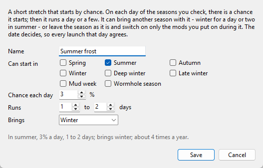

# Configuring seasonal mods

Everything here is optional. With no configuration you get the seasonal atmosphere: light,
color, foliage, fog, wind, wetness, the dial, the MCM pages and the PDA message.

Configuration adds what can't change while the game runs: switching seasonal mods,
swapping texture sets, and gating ambient sound. `_tools\season.py` does that before the
game starts; `play.bat` runs it for you. It also sets where the real weather comes from.

Most setups need no editing by hand. `configure.bat` writes `_tools\seasons_config.py`
for you, and the file stays yours to edit if you would rather; this page is its
reference. `_tools\seasons_config.example.py` is the setup these tools were made on, each
table filled in.

Making a mod seasonal is the common case, but the calendar is open: you can add your own
base periods and overlapping events, and make mods seasonal on those instead. That is
**[docs/SCHEDULING.md](SCHEDULING.md)**.

---

## configure.bat

The first time, open it from the mod's folder: in MO2, right-click the mod, choose **Open
in Explorer**, and double-click `configure.bat` there. It puts `play.bat`,
`configure.bat` and `_tools` in your GAMMA folder, next to `ModOrganizer.exe`, and carries
on from there. After an update, do the same: it updates the tools there and keeps your
setup and the MO2 entry `play.bat` starts.

The setup goes in steps, and nothing is written until the Review step's **Save**:

1. **Start** from what you have set up now, a preset of your own, the GAMMA example, or
   nothing. The GAMMA example is the seasonal mods these tools were made with, for the
   ones you have installed.
2. **Seasonal mods**: a checklist. **Change...** sets when one is on, and under **More
   options** its events, its kinds of weather, and the mod it wins over. **Add another
   mod...** makes any other mod seasonal. Texture sets and the ambient sound are here too.

   **Install one from an archive...** installs a mod you've downloaded into MO2's mods
   folder and makes it seasonal. An installer's options become checkboxes; one that asks
   questions depending on other answers is left to MO2 (Install a new mod from archive),
   after which the mod can be added here. **Add a file...** puts a fix from the mod's
   author where the mod has a file of that name - the CConV1.5.dds that Colorful Autumn's
   author posted goes to its `gamedata\textures\ccon`, say. Archives in your GAMMA and
   downloads folders whose names say a season are listed on the step, with an Install
   button. MO2's mod list isn't touched: MO2 finds the new folder by itself, and `play.bat`
   puts it in the list just above the mod it wins over.

   When a seasonal mod ships files that another seasonal mod on at the same time ships
   too - a recolor and the set it recolors - the setup asks whose the game should use,
   and sets which one wins over the other from the answer.
3. **Seasons**: Polesia's dates, another calendar that comes with the tool, or your own,
   and names of your own, with the year dial as the game will draw it. See
   [`CALENDAR`](#calendar) and [`NAMES`](#names). Below them, **Add a season of your
   own...** and **Add a spell...** make the two things the calendar can add; see
   [`OWN_SEASONS`](#own_seasons) and [`SPELLS`](#spells). A mod is put on in them in its
   **Change...** dialog on the Seasonal mods step: seasons of your own sit with the six,
   spells under **More options**.
4. **Weather**: Chornobyl, or a place you look up. See [`WEATHER_PLACE`](#weather_place).
5. **Review**: the setup in a few lines, and what `play.bat` will switch today. Anything
   `play.bat` would refuse is listed with a **Fix** button that takes you to it.
6. **How to play**: which MO2 entry `play.bat` starts, to change if MO2 names it
   differently.

Once there is a setup, `configure.bat` opens to a summary instead, with a **Change**
button for each part - each saves on its own - **Run the setup again**, **Save as a
preset...**, and **Preview the next launch**, which shows what `play.bat` would switch,
today or in any season.

**Advanced editor...**, on every page, opens the tabbed editor for everything the steps
leave out: making and changing events, and which mod wins over which. It lists your mods
as MO2's left pane does; pick one and check the seasons, events or kinds of weather it
belongs to. Its **Wins over** box names the mod it has to win over - worked out from the
files the two share - and says what else would still win its files. Anything `play.bat`
would refuse shows in red at the top of the window, with a button that takes you to it.
`py _tools\configure.py --advanced` opens it directly.

---

## Commands

Run these in your GAMMA folder. Where they say `py`, use `python` if that is how your
Python starts.

```bash
py _tools\season.py status                 # today's season, what is staged, what is installed
py _tools\season.py apply                  # stage it (what play.bat runs)
py _tools\season.py apply --dry-run        # report what would change
py _tools\season.py apply --season winter  # stage a season other than today's
py _tools\season.py apply --no-textures    # the seasonal atmosphere only, this run
py _tools\season.py whowins <gamedata path> --for "<your mod>"
py _tools\season.py dial                   # hand the calendar and names to the game
```

`status` changes nothing. `apply` does nothing when the staged season already matches the
date. `--mapping met` uses Ukraine's meteorological calendar (round month starts) for one
run; `CALENDAR` is the lasting way to change the dates.

`configure.bat`, as commands (`py _tools\configure.py --help` lists them all):

```bash
py _tools\configure.py list               # the seasonal mods, events and calendar
py _tools\configure.py add "<mod>" --when winter "deep winter" [--above "<mod>"]
py _tools\configure.py remove "<mod>"
py _tools\configure.py event christmas 12-24 12-26
py _tools\configure.py event weekend --weekdays weekends     # a rule; see SCHEDULING.md
py _tools\configure.py event christmas --remove
py _tools\configure.py season                         # your seasons of your own
py _tools\configure.py season "Wormhole season" 08-01 08-31
py _tools\configure.py season "Wormhole season" --rename "Rostok wormhole"
py _tools\configure.py season "Rostok wormhole" --remove
py _tools\configure.py spell                          # your spells, and how often each comes
py _tools\configure.py spell "Summer frost" --in summer --chance 3 --days 1 2 --as winter
py _tools\configure.py spell "Summer frost" --chance 2          # change one part
py _tools\configure.py spell "Summer frost" --remove
py _tools\configure.py calendar           # when each season starts, and which are off
py _tools\configure.py calendar summer=5-1 "deep winter=11-15" [--only]
py _tools\configure.py calendar --off "late winter"
py _tools\configure.py calendar --on "late winter"    # back on, at Polesia's date
py _tools\configure.py calendar --dates met           # the meteorological dates
py _tools\configure.py calendar --reset               # Polesia's again
py _tools\configure.py name                           # what each season is called
py _tools\configure.py name "deep winter" "The Long Cold"
py _tools\configure.py name "deep winter" --reset
py _tools\configure.py place                          # where the weather comes from
py _tools\configure.py place "Kyiv" [--pick 2]        # look a place up and use it
py _tools\configure.py place --at 50.45 30.52 --name Kyiv
py _tools\configure.py place --reset                  # Chornobyl again
py _tools\configure.py preset                         # the presets there are
py _tools\configure.py preset show "Two seasons"
py _tools\configure.py preset load "Two seasons" [--parts calendar] [--force]
py _tools\configure.py preset save "Mine" [--about "..."] [--parts calendar mods]
```

`add` makes a mod seasonal, or replaces when it is on if it already is. The name is
checked against MO2's mod list, with suggestions for a near miss; a name with a space goes
in quotes. `--when` takes seasons as MCM shows them, your own names for them, or as the
config spells them, and any season of your own, spell, event, period or kind of weather.
Without `--above`, the mod
it wins over is the highest enabled mod that ships any of the same files; when another
seasonal mod on in the same season shares files, `add` names it and leaves the choice to
you.

Every save checks the result with `season.py`'s own rules first, keeps the previous file
as `seasons_config.py.bak`, and rewrites only the entries that changed, so comments and
anything written by hand stay as they were. A save that can't keep every comment - one
inside a table written on a single line, say - also keeps a dated copy that no later save
touches, and says where. The tool refuses rather than guess: a file saved in an encoding it
would have to mangle, a table sharing its line with another statement, a table the lines
below it change again, or a file that changed since it was opened is left as it is, with a
message saying what to do.

**Undoing a save:** `seasons_config.py.bak`, next to it in `_tools`, is the file as it was
before the last save. Close `configure.bat`, delete `seasons_config.py` and rename the
`.bak` to `seasons_config.py`.

---

## The seasons, as each place spells them

| In MCM, the PDA and the window | In the config | In commands |
|---|---|---|
| Spring | `spring` | `spring` |
| Summer | `summer` | `summer` |
| Autumn | `autumn` | `autumn` or `fall` |
| Winter | `winter` | `winter` |
| Deep winter | `winter_snow` | `"deep winter"` or `winter_snow` |
| Late winter | `late_winter` | `"late winter"` or `late_winter` |

A name of your own for a season (see [`NAMES`](#names)) works in commands too. The config
keeps the keys either way.

---

## `TOGGLE_MODS`

The seasonal mods. Each is enabled in the seasons, events and weather it lists, and
disabled the rest of the year. Nothing is copied; MO2 stops mounting the folder. Prefer
this to `LAYOUT`.

```python
TOGGLE_MODS = {
    "INVERNO Winter Textures (seasonal)": {        # folder name, exactly as MO2 shows it
        "when": ("winter", "winter_snow", "late_winter"),
        "above": "388- Aydins Grass Tweaks SSS Terrain LOD Compatibility - aytabag",
    },
}
```

| Field | Meaning |
|---|---|
| *key* | The mod folder name under `mods/`. A folder that is not installed is skipped. |
| `when` | When the mod is enabled: any mix of seasons (`spring`, `summer`, `autumn`, `winter`, `winter_snow`, `late_winter`), your events and periods, and the kinds of weather `freezing`, `thaw` and `heat`. One name needs the trailing comma: `("winter",)`. `seasons` is the original spelling of this key and still works. |
| `above` | The mod this one wins over. `play.bat` keeps it just above that mod in `modlist.txt` - just below it in MO2's left pane - so where both ship a file, this one's is used. `configure.bat` picks it for you. |

The weather comes from the real forecast `play.bat` fetches at each launch, for the place
set in `configure.bat`: `freezing` is a day whose low is 0°C or below, `thaw` one that also
climbs above 0°C by afternoon, and `heat` one whose high reaches 28°C. Like an event, a
weather day is added to whatever season is running. Without `play.bat`, or without a
connection, none of them is on.

Each seasonal mod gets its own checkbox on the MCM page of every season it is on in, with
its file count and size. Unchecking it there means "never mount this in that season"; the
same mod can stay on for another season.

### Which mod it wins over (`above`)

MO2 gives a shared file to the enabled mod with the highest priority that ships it: the
one lowest in its left pane. If a mod that wins over yours ships the same file, yours loses
and nothing tells you. `configure.bat` works the right `above` out from the files the mods
share. To check by hand, pick a file your mod ships and ask, naming your mod with `--for`:

```bash
py _tools\season.py whowins textures/map/map_escape.dds --for "Winter PDA Maps (seasonal)"
```

```
  file: gamedata/textures/map/map_escape.dds

    line   190  disabled  Winter PDA Maps (seasonal)             2097280 B   <-- yours
    line   539  enabled   358- Global Map Rework - DeadEnvoy     8388736 B   <-- yours has to win over this one
    line   862  enabled   26- High Res PDA Maps - Bazingarrey    8388736 B

  Make Winter PDA Maps (seasonal) win over:  358- Global Map Rework - DeadEnvoy
  In the config:  "above": "358- Global Map Rework - DeadEnvoy"   (in configure.bat: its Wins over box)
```

`--for` keeps your mod out of the answer. Without it, the top enabled mod is named, and
the one under it too, in case the top one is yours: MO2 puts a fresh install at the top.
If no mod ships the file, any position works.

Placement is checked on every run. If the mod it wins over is no longer in MO2's mod list
(GAMMA renumbers folders between versions), that entry is skipped with a warning and the
others still run.

`above` only keeps a mod just above that one mod. `season.py status` also checks every file
of every seasonal mod against every other mod, in the order `apply` leaves them, and
reports:

- `! <mod> loses N files to "<other>"` — an enabled mod still wins some of its files. In
  `configure.bat`, make it win over that mod, or disable that mod.
- `- N disabled mods in MO2 would win some of <mod>'s files if enabled` — nothing wrong
  yet; check again after enabling one.
- `- "<other>" wins N of <mod>'s files in <seasons>` — two seasonal mods on in the same
  season share files, and the one listed wins. Fine if that is the intent.

`play.bat` runs the same check whenever MO2's mod list has changed.

---

## `LAYOUT`

Texture sets: for mods that ship one folder per season inside one archive, such as Aydin's
Grass Tweaks.

```python
LAYOUT = {
    "289- Grass Tweaks (reinstall for different options) - Aydin": {
        "archive": "Aydins_Grass_Tweaks_4.0.7z",     # filename in MO2's downloads folder
        "options": {
            "spring": ["Aydin's Grass Tweaks - SPRING 4.0",
                       "Aydin's Grass Tweaks - SPRING TREES 4.0"],
            "summer": ["Aydin's Grass Tweaks - SUMMER 3.0", ...],
            ...
        },
    },
}
```

| Field | Meaning |
|---|---|
| *key* | The installed mod folder whose contents are replaced. |
| `archive` | Filename in `downloads/`. `.7z` needs `py -m pip install py7zr`; `.rar` needs `rarfile` plus WinRAR or 7-Zip. |
| `options` | Season → folder names inside the archive, applied in order (later ones win). |

Gigabytes are copied on a season change, so use `TOGGLE_MODS` wherever a mod can be
switched off instead. A season with no entry keeps whatever is already staged. An archive
that is missing from `downloads/` skips that texture set with a warning; the rest of the
launch goes on.

What is installed is identified by hashing the folder against the archive's options, so a
correct season is never re-copied. The archive-side hashes are cached after the first run.

---

## `SOUND_SRC`

```python
SOUND_SRC = "304- Dark Signal Weather and Ambiance Audio - Shrike"
```

Name the mod that wins your `configs/environment/ambients/presets/` files (several
soundscape mods ship the same presets; use `whowins`). `season.py` generates a
`Seasonal Soundscape` mod from that mod's files with these channels removed:

| Season | Silenced |
|---|---|
| spring | night crickets |
| summer | nothing |
| autumn | daytime insects, swamp birds |
| winter | all insects, swamp birds |
| deep winter | all insects, swamp birds, daytime birds |
| late winter | all insects |

Wind, storms, thunder and interiors are never touched. Crows and owls stay all year.
Crickets belong to summer and autumn nights, so spring is carried by the dawn chorus
alone; autumn keeps them calling until the first frost but loses the daytime insects.
The thaw brings the marsh birds back before any insect stirs.

The generated files record which channels they were cut with, so editing this table
rebuilds them at the next launch rather than waiting for the season to turn.

The generated mod is placed just above `SOUND_SRC` and follows the MCM switch; you do not
touch it in MO2. If you disable the source mod, the generated presets are removed at the
next launch. Leave `SOUND_SRC = None` to skip the layer.

---

## `CALENDAR`

```python
CALENDAR = {
    "summer": (5, 1),            # (month, day) the season starts
    "winter_snow": (11, 15),
}
```

The seasons that are on and the day each starts. `configure.bat`'s Seasons step writes it,
and `configure.py calendar` does from a command prompt. Each season runs until the next one
that is on, so a season left out gives its days to the one before it; the example is
summer from May 1 and deep winter from November 15, and nothing else. `None`, or no
`CALENDAR` at all, is Polesia's six.

Every season needs at least 14 days, no two can start on the same day, and none can start
on February 29, which three years in four do not have. At least one has to be on.

A mod on only in seasons that are off is never switched on; `season.py status` names it. An
MCM pin on a season that is off counts as automatic.

`play.bat` hands the calendar to the game in `configs/season_calendar.ltx`, and saving from
the tool does too, so the seasonal atmosphere follows it from the next start even without
`play.bat`. MCM shows a page and a pin for each season that is on.

The year dial is redrawn for your dates, 32 images in the mod's `textures/` folder. That
needs Pillow, a Python package: `py -m pip install pillow`, which the tool offers to run.
Without Pillow the dial is hidden, since the shipped one shows Polesia's dates.
`season.py dial` draws it by hand, and a return to Polesia's calendar deletes it.

---

## `NAMES`

```python
NAMES = {
    "winter_snow": "The Long Cold",
    "late_winter": "Rasputitsa",
}
```

Names of your own for the seasons. The game shows them wherever it names a season: the PDA,
the messages when a season turns, MCM's page titles and the Season list, and the year
dial, which is redrawn with them as for a calendar of your own. The config keeps the
usual keys, so `when`, `LAYOUT` and everything else still say `winter_snow`.

A name is up to 20 letters, English or Cyrillic, which is what the game can show; two
seasons can't share one. `None`, or a name left as the usual one, keeps the usual name.

---

## `OWN_SEASONS`

```python
OWN_SEASONS = {
    "Wormhole season": ((8, 1), (8, 31)),
    "Mud week": ((3, 20), (3, 26)),
}
```

Seasons of your own: a name, and the first and last day, both counted. Each runs on top of
the season it falls in, as an event does - the mods on in it come on for its days, and the
season's own mods stay on - so it doesn't cut into the calendar. A window whose first day
comes after its last runs across the new year.

- A season of your own runs **at least a week**; a shorter stretch is an event.
- There can be **up to 52**, one for each week of the year.
- A name is up to 24 characters and can't be a season's, an event's, a period's or a kind
  of weather's, in any capitals. It can have spaces: `"Wormhole season"` is fine.
- February 29 can't be a first or last day.

`configure.bat`'s Seasons step makes them, and so does `configure.py season`. Taking one
off takes it off every mod on in it; a mod on in nothing else comes off the calendar, and
the window asks first.

 Renaming one renames it for its mods too. They are not on the dial
or the MCM pages, and `status` names the ones on today on its `also today` line.

---

## `SPELLS`

```python
SPELLS = {
    "Summer frost": {"in": ("summer",), "chance": 3, "days": (1, 2), "as": "winter"},
    "Wormhole storm": {"in": ("Wormhole season",), "chance": 10, "days": 2, "as": None},
}
```

A spell is a short stretch that starts by chance. See
[SCHEDULING.md](SCHEDULING.md#seasons-of-your-own-and-spells) for how it is decided.

| Part | Meaning |
|---|---|
| `in` | The seasons it can start in: the six, as the config spells them, and yours. Seasons off in your calendar don't count. |
| `chance` | The percent chance it starts on each of those days, more than 0 and up to 100. Decimals are fine: `0.5`. |
| `days` | How long it runs: a number, or the fewest and the most, `(1, 2)`. 1 to 6; a week or longer is a season of your own. |
| `as` | The season it brings, which has to be on in your calendar, or `None` to leave the season as it is. |

A spell that brings a season makes it the season for as long as it lasts: `play.bat` stages
that season's mods, texture sets and sound, and writes the spell into the file the game
reads, so the light and the weather follow it until its last day, and the PDA's message as
the game loads and the MCM page name it. The PDA's Seasons app keeps to the calendar, as
it does for an MCM pin. An MCM pin wins over a spell. The mods on during a spell come on
whether it brings a season or not.

The Seasons step's **Add a spell...** shows how often a spell comes on average as you set
it - 3% a day in Polesia's summer is about 3 a year - and `configure.py spell` lists each
one that way.

 `status` shows a spell on today on its `season` line.

---

## `WEATHER_PLACE`

```python
WEATHER_PLACE = {"name": "Kyiv", "lat": 50.4547, "lon": 30.5238}
```

Where the real weather comes from: the PDA's temperature, its Forecast page, and the
`freezing`, `thaw` and `heat` days. `None`, or no `WEATHER_PLACE` at all, is Chornobyl.
`configure.bat`'s Weather step writes it - search for a town, or give its coordinates -
and `configure.py place` does from a command prompt. The seasons don't move with it: a
place in the southern hemisphere wants the Southern hemisphere preset, or a calendar of its
own.


| Field | Meaning |
|---|---|
| `name` | What the PDA calls it, up to 24 characters. Letters the game can't show lose their accents there: São Paulo reads Sao Paulo. |
| `lat` | Latitude in degrees, -90 to 90, north positive. |
| `lon` | Longitude in degrees, -180 to 180, east positive. |

At each launch `play.bat` asks [Open-Meteo](https://open-meteo.com/) for the day's high and
low there, sending the coordinates and nothing else. For a place other than Chornobyl, the
first fetch also asks once for its last ten years of daily highs and lows, so the game can
model a day there without a connection; Chornobyl's are built in. The search on the Weather
tab sends what you type to Open-Meteo's place search. A preset never holds the place.

The weather data is by Open-Meteo.com, under
[CC BY 4.0](https://creativecommons.org/licenses/by/4.0/); the place search is based on
[GeoNames](https://www.geonames.org/) (CC BY 4.0), and the climate history contains
modified Copernicus Climate Change Service information (ERA5). The PDA, `configure.bat` and
`play.bat` credit it where they show it. The game moves the day's temperature with its own
sky, so the numbers on the PDA are Open-Meteo's endpoints, changed.

---

## Presets

A preset keeps a setup under a name, in `_tools\presets\`, as a JSON file: plain data, so
one posted by someone else can be loaded without running anything they wrote. It holds any
of four parts:

| Part | What it is |
|---|---|
| calendar | `CALENDAR` and `NAMES` |
| events | `OWN_SEASONS`, `SPELLS`, `EVENTS` and `PERIODS` |
| mods | `TOGGLE_MODS` |
| textures | `LAYOUT` and `SOUND_SRC` |

**Save preset...** in the window, or `configure.py preset save`, keeps the parts that have
something in them, unless you pick others. **Load preset...** shows what each part would
replace before you load it, then sets the parts you choose in place of yours; like any
change in the window it is written only when you save. `configure.py preset load` saves
at once, so it refuses to replace anything of yours unless you add `--force`. A preset made
on another install loads here: a mod you don't have is left out, a mod whose `above` you
don't have gets another for your list, a texture set whose archive is not in your
`downloads/` is left out, and loading says which. Every part goes through the same rules
as a save, and a preset that would break the config is refused whole.

Four calendars come with the tool: Polesia, Meteorological, Two seasons and Southern
hemisphere. The GAMMA example holds the seasonal mods, events, texture sets and sound
source these tools were made on; its texture sets need `py7zr`, and a mod you have renamed
is left out. A preset of the same name as one that comes with the tool can't be saved over
it.

---

## Color grade presets

The mod ships its season grades as `cfg_load` presets, `Seasons_*.ltx`, in
`gamedata/configs/seasons_presets/`. `play.bat` copies them into the game's `appdata/`
if they are not there, beside Atmospherics' `Atmos_*.ltx`; an existing copy is never
overwritten, so you can tune them in place. Which color grade preset a season uses is
chosen on that season's MCM page, not here.

---

## Troubleshooting

**The mod switched but nothing changed on screen.** Almost always `above`. Run `whowins`
on a file the mod ships, and make it win over the mod named there.

**`! <mod> skipped: the mod it wins over, "...", is not in MO2's mod list.`** That mod was
renamed or removed. Pick another in the mod's **Wins over** box in `configure.bat`.

**`seasons_config.py is not saved as UTF-8`.** Notepad saves as ANSI or UTF-16 when asked
to; the tools read UTF-8. In Notepad, File > Save as, set Encoding to UTF-8, then Save.

**`_tools\seasons_config.py needs fixing before play.bat can switch anything`.** The
message names the line, or the entry and the field. `configure.bat` shows the same list at
the top of its window. The usual mistakes:

- `("winter")` is a string, not a tuple. One season needs the trailing comma:
  `("winter",)`.
- A comma in the wrong place, or missing between two entries. Python can only say
  roughly where, so a missing comma is reported as a range of lines; it goes after the
  `}` that closes an entry.
- A name without quotes: `winter_snow` instead of `"winter_snow"`.
- The same table set twice, often an entry added above the template's empty
  `TOGGLE_MODS = {}`. Python keeps the last one, so the entry would be thrown away.

`whowins` still runs while the file has a mistake in it.

**The year dial is gone.** A calendar or names of your own need a dial drawn for them, and
drawing one needs Pillow: `py -m pip install pillow`, then `py _tools\season.py dial`.

**Textures are wrong for the season.** The mod says so in the log on load: *"TEXTURES ARE
STAGED FOR X but the season running is Y"*. Exit, and start the game with `play.bat`.

**The PDA says "No station data".** `play.bat` couldn't reach Open-Meteo on the last launch,
or the game was started without it. The temperature is modeled from the place's climate
until the next reading.

**MO2 undid my mod list edit.** MO2 rewrites `modlist.txt` when it closes. Close it before
running the tools, or use `play.bat`.

**Nothing happens.** Check MCM → Seasons of the Zone → *Enable seasonal atmosphere*, and
that the log has `[seasons] armed` followed by `[seasons] <season> applied`.
