# Install guide

A first install and every window it opens. The screenshots come from one run, start to
finish, on a copy of a GAMMA install that already had ten seasonal
mods in MO2 and no Seasons of the Zone setup yet, on September 26, which Polesia's
calendar puts in autumn. The numbers on each screenshot match the list under it. The GAMMA folder in these
screenshots is `C:\GAMMA`; yours is wherever `ModOrganizer.exe` is.

*The texture mods shown are third-party mods, not included here.*

---

## Before you start

- **GAMMA** through **Mod Organizer 2**, with **MCM** and **Mod App Creator**, which the
  PDA app opens from.
- **Python 3** from [python.org](https://www.python.org/downloads/), for `configure.bat`
  and `play.bat`. Check **Add python.exe to PATH** as it installs.
- **The seasonal mods you want switched**, installed in MO2 like any other mod. The
  README's [Mods that work well this way](../README.md#mods-that-work-well-this-way) lists
  the ones these tools were made with. You can also install them from the setup later.
- Only for texture sets swapped from a `.7z`, like the GAMMA example's grass: run
  `py -m pip install py7zr` once. The setup says so if it's missing.

The in-game part - the light and weather, the marked days, the PDA app and MCM - needs only
step 1. Steps 2 to 4 add real-world weather and the mods that switch with the seasons.

---

## 1. Install the mod in MO2

1. Download `SeasonsOfTheZone.zip` from the
   [Releases page](https://github.com/devinhorowitz/seasonsofthezone/releases).
2. In MO2, click **Install a new mod from archive**, choose the zip and click **OK**. Any
   name works; these screenshots use **Seasons of the Zone**.
3. Check the box beside it in MO2's left pane to enable it.

## 2. Put the tools in your GAMMA folder

In MO2, right-click **Seasons of the Zone** and choose **Open in Explorer**. Double-click
`configure.bat` in the folder that opens.

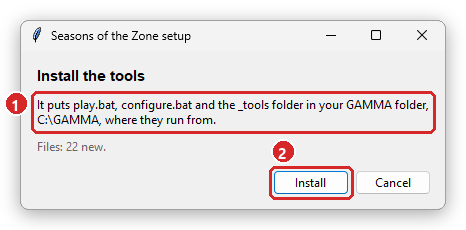

1. Where the tools go: your GAMMA folder, two folders up from the mod, next to
   `ModOrganizer.exe`. `play.bat`, `configure.bat` and the `_tools` folder run from there.
2. **Install** copies them. Nothing else in the GAMMA folder is touched.

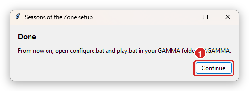

1. **Continue** opens the setup, from the GAMMA folder's copy. From now on, open
   `configure.bat` and `play.bat` there.

## 3. The setup

Six steps, about two minutes. **< Back** returns to the step before, and nothing is saved
until the Review step.

### Step 1: Start

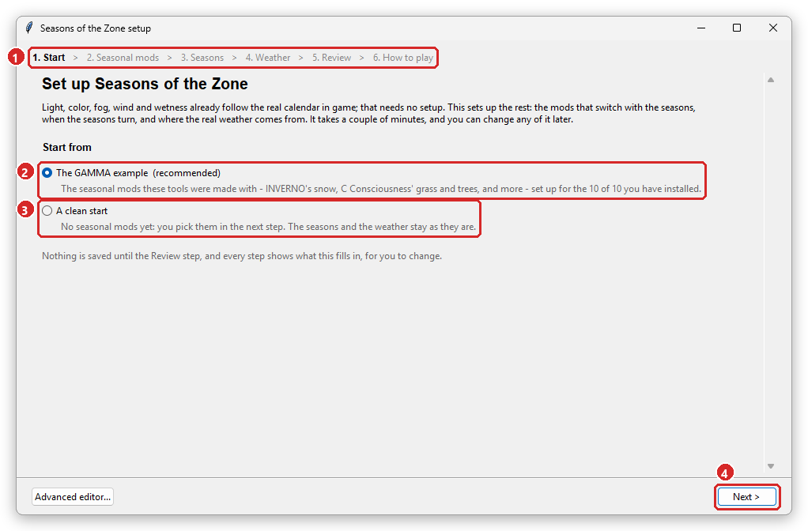

1. The six steps. The one you're on is in bold.
2. **The GAMMA example** fills in the seasonal mods these tools were made with, for the ones
   you have installed: here all 10 of 10. Recommended when you have any of them.
3. **A clean start** begins with no seasonal mods; you pick them in the next step.
4. **Next >** goes on. Every later step shows what this filled in, for you to change.

### Step 2: Seasonal mods

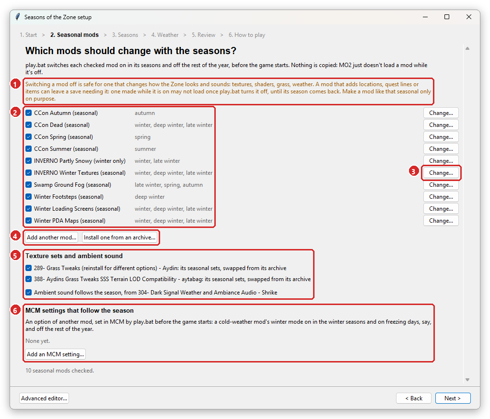

1. **Switch with care.** Switching a mod off is safe for one that changes how the Zone
   looks and sounds. One that adds locations, quest lines or items can leave a save that
   won't load until its season comes back. Make a mod like that seasonal only on purpose.
2. The checklist: each checked mod and the seasons it's on in. `play.bat` switches it on
   in those seasons and off the rest of the year. Uncheck one to leave it as it is in MO2.
3. **Change...** sets when that mod is on (next screenshot).
4. **Add another mod...** makes any installed mod seasonal. **Install one from an
   archive...** installs a mod you've downloaded and makes it seasonal in one go, with its
   installer's options.
5. Texture sets that are swapped from their archives each season, and ambient sound that
   follows the season. Both come from the GAMMA example.
6. **MCM settings that follow the season**: another mod's MCM option, set by `play.bat`
   before the game starts, like a cold-weather mod's winter mode.

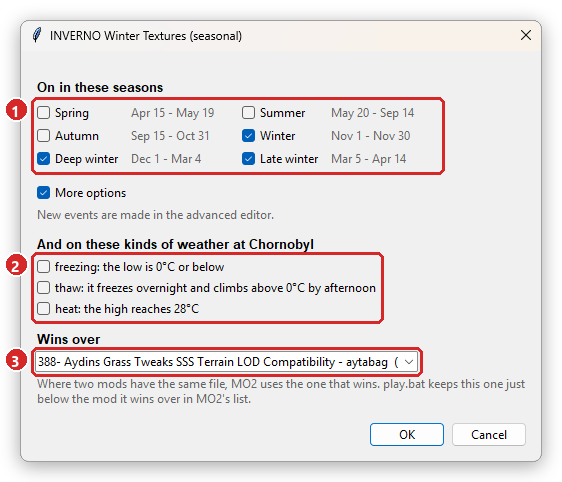

1. The seasons it's on in, with the dates each one runs.
2. Under **More options**: also on for these kinds of real weather at your weather place.
3. **Wins over**: the mod whose files this one has to win in MO2's list. It's picked from
   the files the two share; `play.bat` keeps this mod just below that one.

### Step 3: Seasons

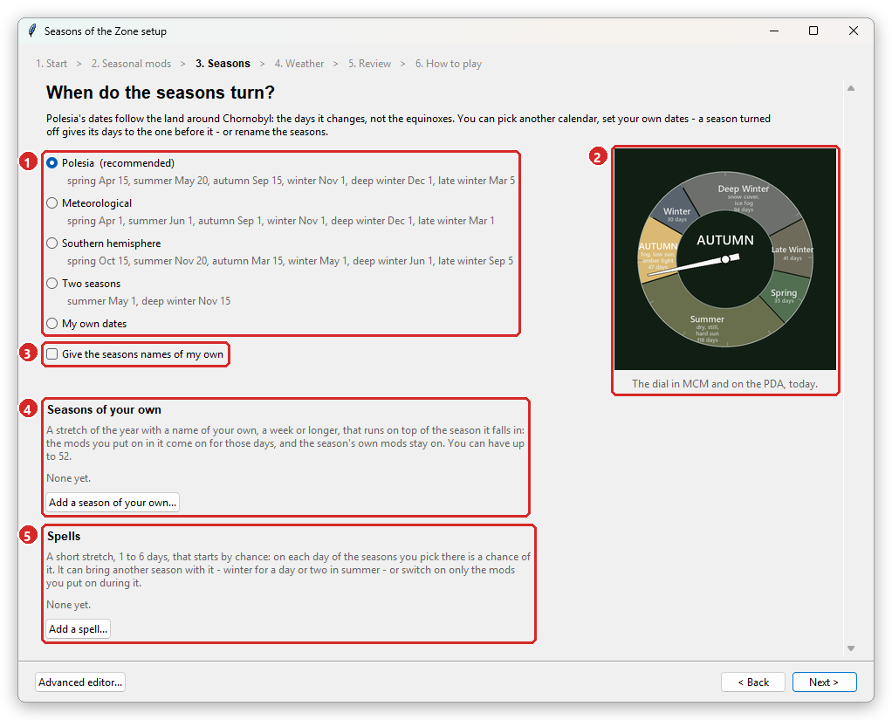

1. The calendar. Polesia's dates follow the land around Chornobyl. Pick another calendar,
   or **My own dates**.
2. The year dial as MCM and the PDA will draw it, with today's season.
3. Names of your own for the seasons, if you like.
4. **Seasons of your own**: a stretch of a week or longer with its own name, that runs on
   top of the season it falls in.
5. **Spells**: a short stretch, 1 to 6 days, that starts by chance and can bring another
   season with it, like winter for a day in summer.

### Step 4: Weather

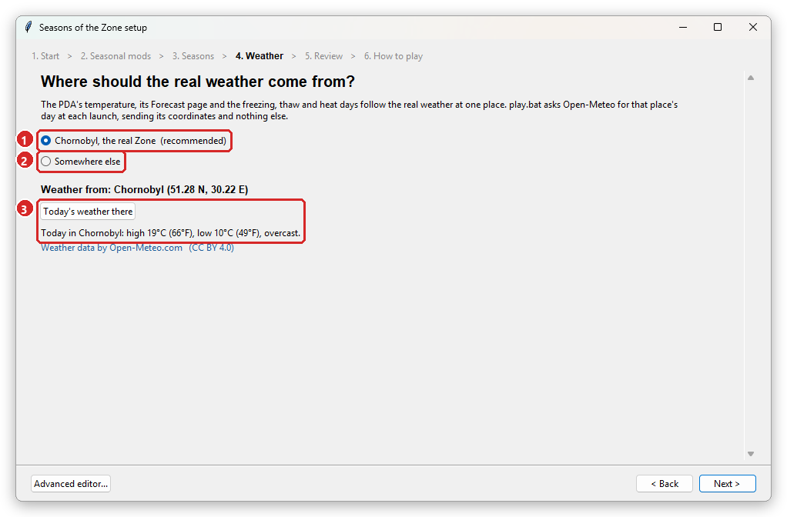

1. **Chornobyl, the real Zone**: recommended.
2. **Somewhere else**: a town or city you look up (next screenshot).
3. **Today's weather there** asks Open-Meteo now, as `play.bat` does at each launch.

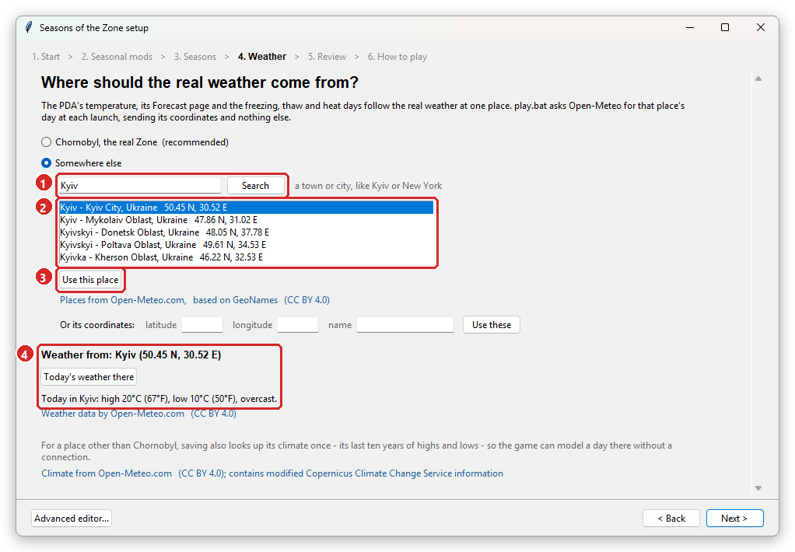

1. Type a name and click **Search**.
2. Pick one of the places found.
3. **Use this place**.
4. The weather now comes from there. Saving also looks up its climate once, so the game
   can model a day there without a connection.

This run went back to Chornobyl before going on.

### Step 5: Review

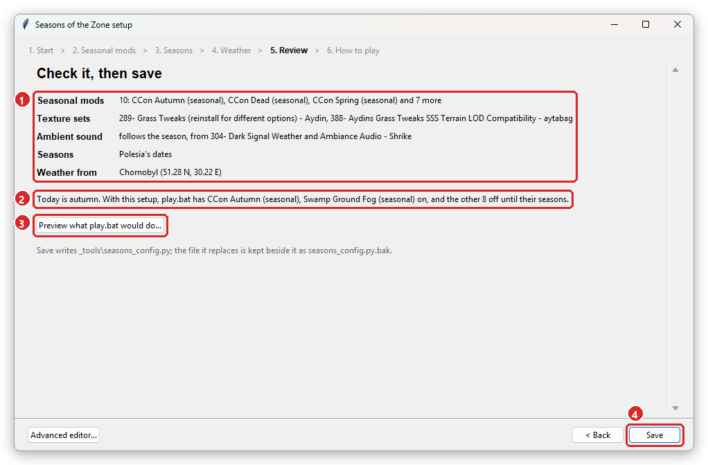

1. What you set up.
2. What `play.bat` will do today: it's autumn, so CCon Autumn and Swamp Ground Fog go on,
   and the other 8 stay off until their seasons.
3. **Preview what play.bat would do...** (next screenshot).
4. **Save** writes `_tools\seasons_config.py`. Nothing was written before this.

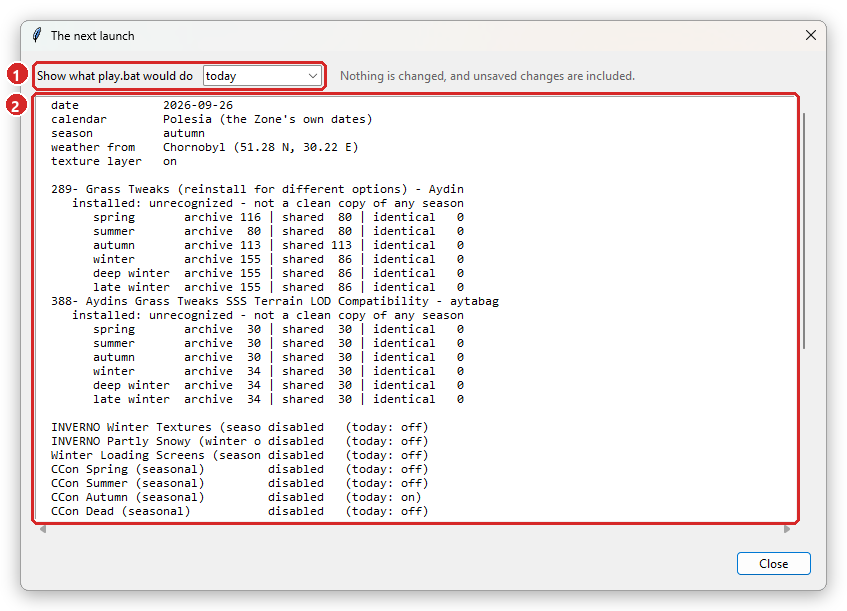

1. Today, or any season you pick.
2. The lines `play.bat` would print. Nothing is changed.

### Step 6: How to play

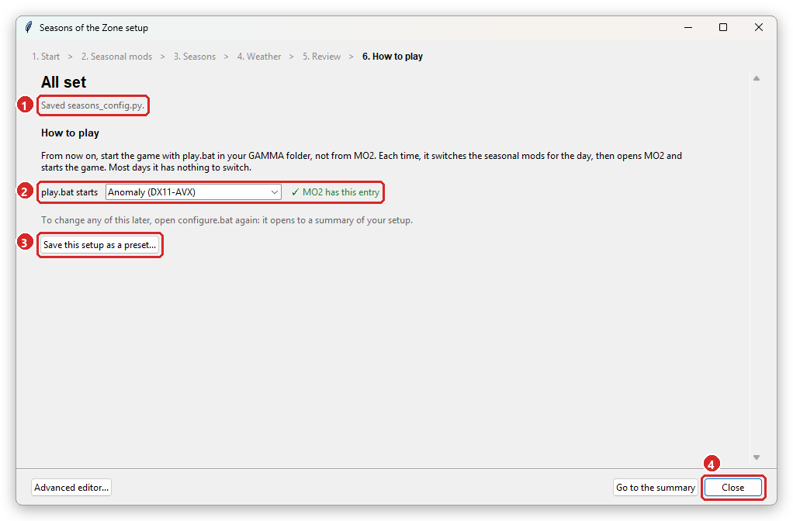

1. What was saved.
2. **play.bat starts** the MO2 entry named here: GAMMA's **Anomaly (DX11-AVX)** unless you
   pick another. It says whether MO2 has that entry.
3. **Save this setup as a preset...** keeps it under a name, to load again or share.
4. **Close**.

## 4. Play

Close MO2, then double-click `play.bat` in your GAMMA folder. It can't switch mods while
MO2 is open, and it opens MO2 itself.

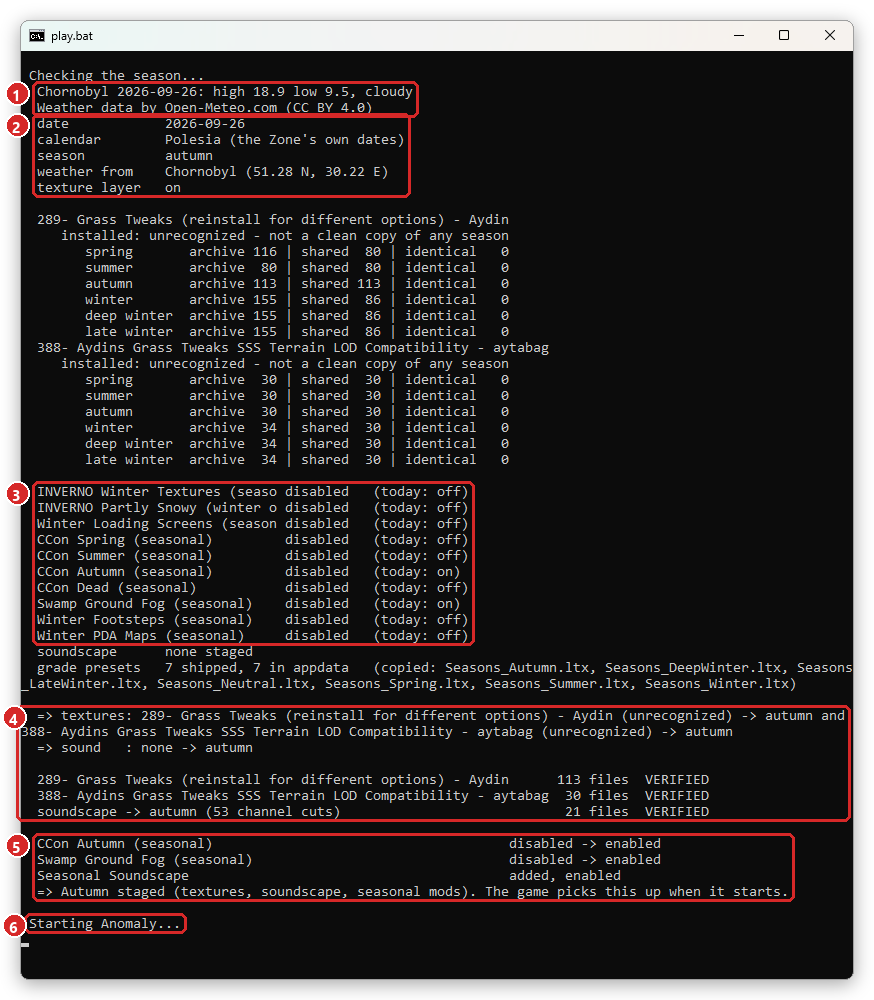

1. The day's real weather at your place, from Open-Meteo.
2. The date and the season.
3. Each seasonal mod: how MO2 has it now, and whether it belongs on today.
4. The texture sets and the ambient sound, staged for autumn, every file checked. The
   table above them compares each texture set's installed files with every season's set
   in its archive.
5. The mods switched: CCon Autumn and Swamp Ground Fog on, and the soundscape mod added.
6. Then MO2 starts the game.

Most later launches have nothing to switch and go straight to the game. Starting the
game from MO2 still works: `play.bat` is what moves the seasonal mods along with the
date. Without a connection it uses the forecast it last fetched, 16 days of it.

## 5. Changing it later

Open `configure.bat` in your GAMMA folder again. It opens to a summary.

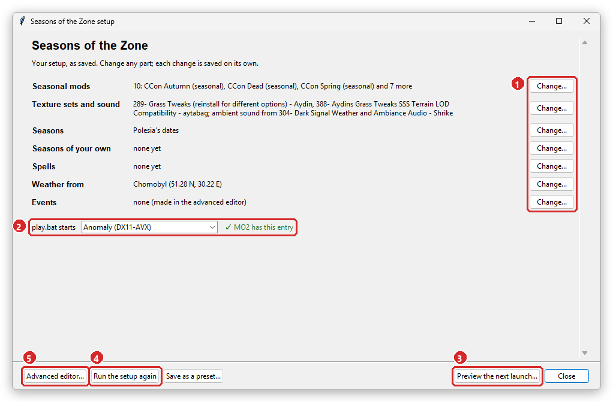

1. **Change...** any part. Each change is saved on its own.
2. The MO2 entry `play.bat` starts.
3. **Preview the next launch...** shows what `play.bat` would switch.
4. **Run the setup again** goes through the six steps from the start.
5. **Advanced editor...** has everything the steps leave out (next screenshot).

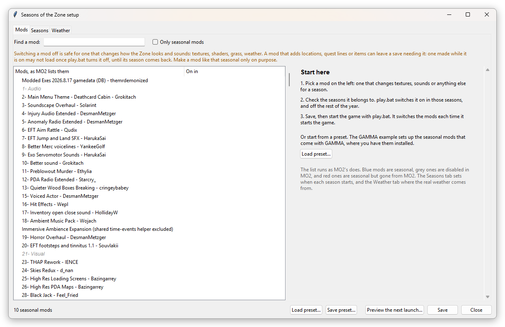

The advanced editor lists MO2's mods as MO2 does. It sets the seasons, events and weather
each mod is on in, and the mod it wins over. It also makes events, and saves and loads
presets. [CONFIGURING.md](CONFIGURING.md) covers every field.

---

## In game

MCM's **Seasons of the Zone** page has a switch for each layer and a checkbox for each
seasonal mod, season by season. The PDA's **Seasons** app shows the year and the forecast.
[INTERFACE.md](INTERFACE.md) walks through both.

## Updating

Install the new zip over the old one in MO2 and choose **Replace**. Then open
`configure.bat` from the mod's folder again, as in step 2. Its window says **Update the
tools** and keeps your setup and the MO2 entry `play.bat` starts.

## If something's wrong

- **configure.bat says Python is missing**: install it from python.org with **Add
  python.exe to PATH** checked, then open `configure.bat` again.
- **play.bat says MO2 has no shortcut by that name**: pick the entry you play with beside
  **play.bat starts** in `configure.bat`.
- **play.bat stops with an error**: the lines above it say why. Press a key to start the
  game anyway, or close the window to fix it first. [CONFIGURING.md](CONFIGURING.md) has
  troubleshooting.
