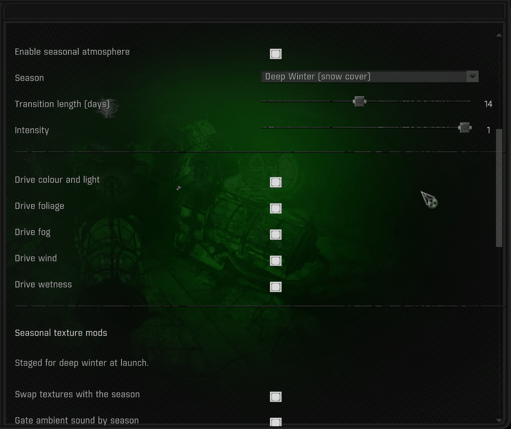
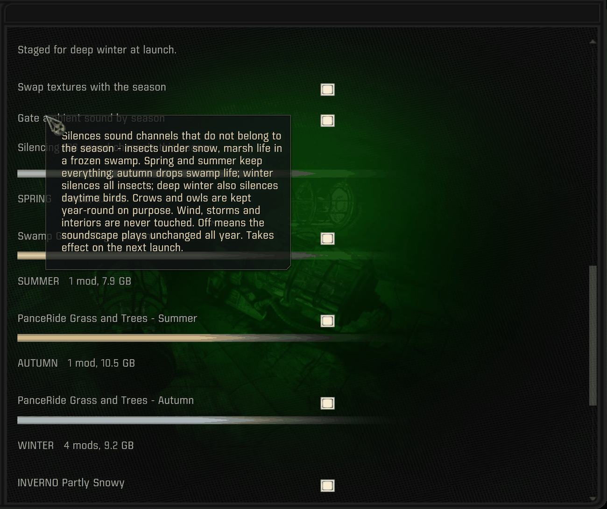

# The MCM page

Everything is on one page: **MCM → Seasons of the Zone**. There is no HUD element, no
pop-up and no key binding.

---

## The year dial

The page opens with a short summary, today's date, and a dial of the year with the needle
on the current day. Each wedge is sized by the season's real length: summer is a third of
the year, autumn seven weeks.

The dial's colors are each season's own color grade, so it also shows what the game is
graded towards.

It follows the calendar and ignores the pin below it. In this capture *Season* is pinned
to Deep Winter while the dial shows mid-September.

Below the dial:

- **Enable seasonal atmosphere** — the master switch.
- **Season** — automatic, or pin one.
- **Transition length (days)** — the blend window centered on each boundary. 0 switches on
  the date.

## The layers

**Intensity** mixes the season with GAMMA's stock look: 0 is stock, 1 the full season.

Then one switch per layer — color and light, foliage, fog, wind, wetness — so a layer you
would rather tune yourself can be switched off on its own.

Below those, one dropdown per season (and one for neutral, what intensity 0 renders)
picks the `cfg_load` preset that season's color grade comes from: Built-in (the season
table), Atmospherics' presets, the mod's `Seasons_*` files, or any preset of your own in
`appdata/`. Takes effect on Apply.

Below the rule, the launch-time section says what was staged at launch ("Staged for deep
winter at launch"), because that layer cannot change mid-session. **Swap textures with the
season** is its master switch: off, the in-engine seasons continue and no texture mod is
mounted or unmounted.

## Season-scoped mods

Every mod named in `seasons_config.py` appears here, grouped under its first season behind
a colored bar, with the group's mod count and total size. Switching a mod off here means
"never mount this", and the choice persists.

The entries shown are third-party texture packs (I.N.V.E.R.N.O, PanceRide and others).
None of them are included in this mod.

## Hover text

Every option has hover text. For the generated entries it gives the mod's size and whether
it is mounted now. The ambient-gating text lists exactly what is silenced in each season.

---

## In the Zone

Autumn: low amber sun, thinned canopy, the grade pulled towards yellow-brown.

Deep winter: snow cover, flat contrast, cold light and ice fog.

Both shots combine this mod's in-engine grading with third-party texture layers it stages
for the season (PanceRide's autumn set above, Project I.N.V.E.R.N.O's winter set below).
The color, fog, wind and wetness are the mod; the ground and foliage textures are their
authors'.
