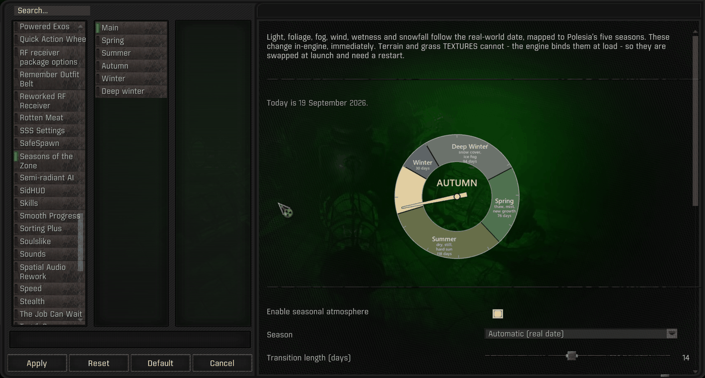
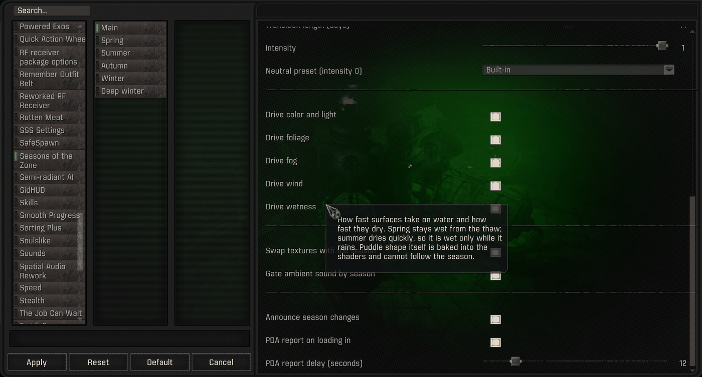
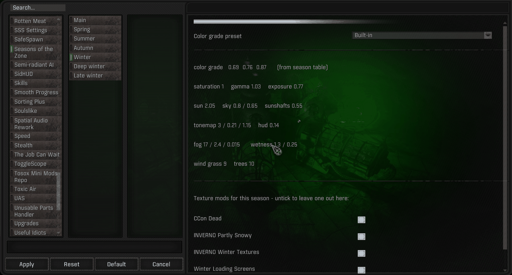
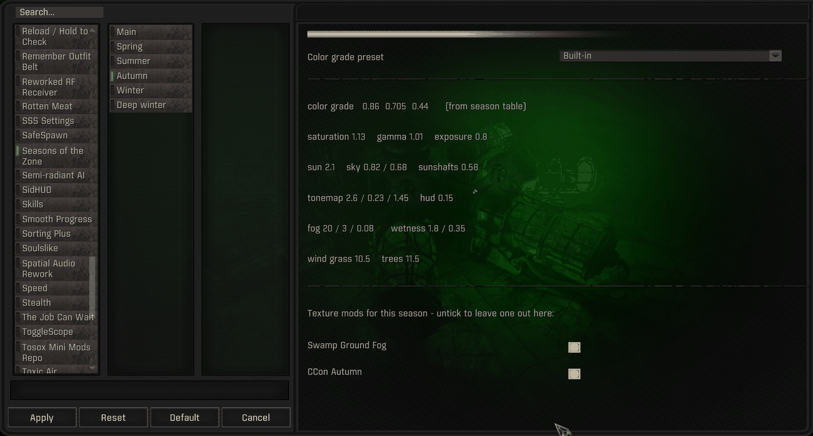
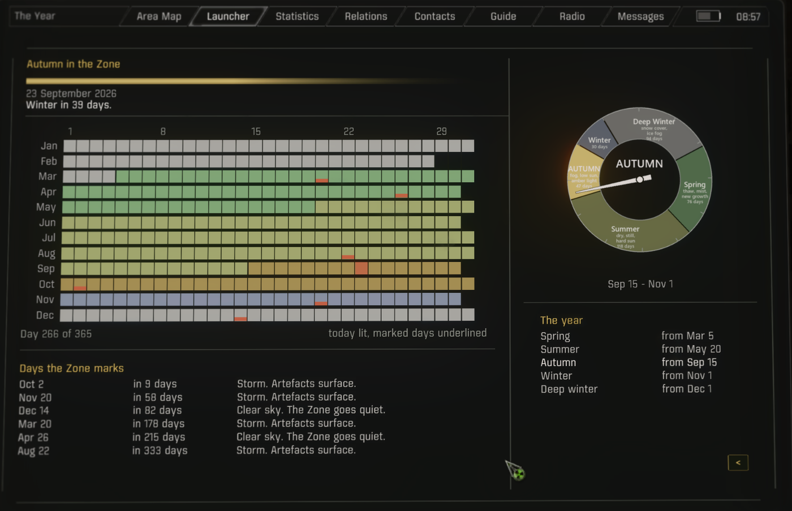
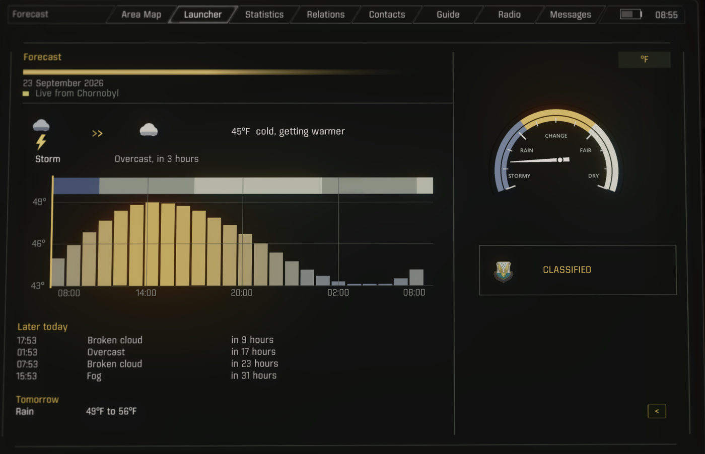
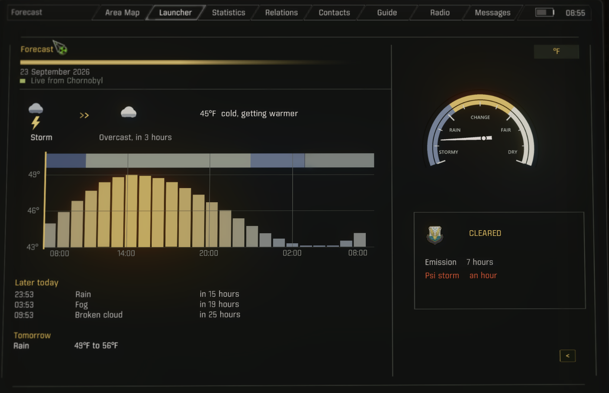
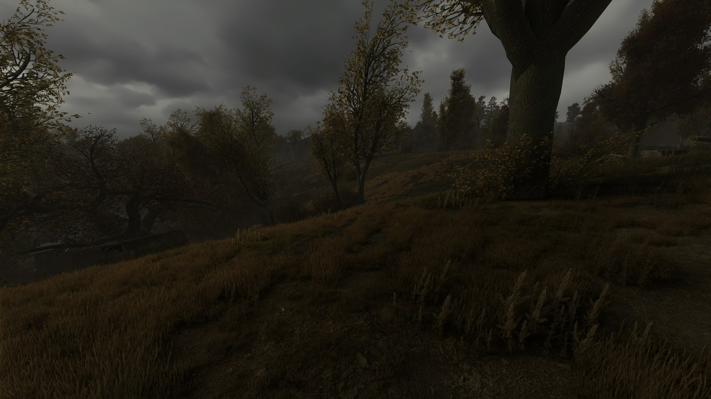
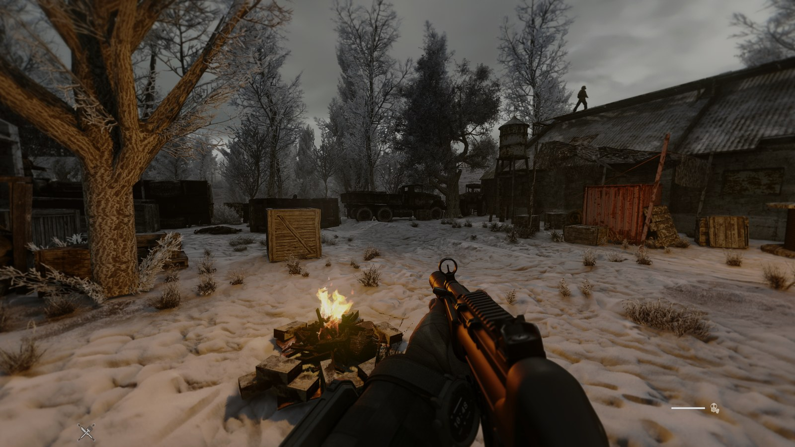

# The interface

Two surfaces. **MCM → Seasons of the Zone** is where the mod is configured: seven pages in
MCM's second column, Main and then one per season — Spring, Summer, Autumn, Winter, Deep
winter, Late winter. A calendar of your own, from `configure.bat`, leaves out the pages
of the seasons it turns off, and names of your own for the seasons title the pages and
fill the Season list. The **Seasons** app in the PDA is where it is read: one app with two faces, **The
Year** and **Forecast**. There is no HUD element, no pop-up and no key binding.

---

## Main

At the top, under the summary, two lines show what the PDA app needs:

- **Mod App Creator.** The Seasons PDA app opens from its launcher. Red if it's missing.
- **The weather scheduler.** The base game's, which GAMMA uses, or Atmospherics' day planner
  if you've installed it. This sets how far ahead the forecast can see; see [Forecast](#forecast--the-pda-page).
  Red only if there's no weather manager at all.

The page opens with a short summary, today's date, and a dial of the year with the needle
on the current day. Each wedge is sized by the season's real length: summer is a third of
the year, autumn seven weeks.

The dial's colors are each season's own color grade, so it also shows what the game is
graded towards. It follows the calendar and ignores the pin below it. With a calendar of
your own the dial is redrawn for your dates; when it could not be drawn (that needs
Pillow, see [CONFIGURING.md](CONFIGURING.md#calendar)) it is left out.

Below the dial:

- **Enable seasonal atmosphere** — the master switch.
- **Season** — automatic, or pin one of the seasons your calendar has on. A pin drives
  everything: the seasonal atmosphere changes within five seconds, and the seasonal mods
  and soundscape follow the next time you start with `play.bat`, since it switches them
  before the game starts.
- **Transition length (days)** — the blend window centered on each boundary. 0 switches on
  the date.
- **Intensity** — 0 is GAMMA's stock look, 1 the full season.
- **Neutral color grade preset (intensity 0)** — which color grade preset the neutral
  baseline uses.

Then one switch per layer — color and light, foliage, fog, wind, wetness — so a layer you
would rather tune yourself can be switched off on its own.

Below those are the two switches for what `play.bat` changes at launch, which can't
change mid-session. **Swap textures with the season** is the master switch for seasonal
mods and texture sets: off, `play.bat` disables every seasonal mod and leaves texture sets
as they are, and the seasonal atmosphere carries on. **Seasonal ambient sound** is the
soundscape's.

### Days

Six fixed dates sit on top of whatever season is running. None of them change the season:
April 26 is still spring, December 14 still deep winter.

Two are **remembrance days** — April 26, International Chernobyl Disaster Remembrance Day,
and December 14, Ukraine's Liquidators' Day. On these the Zone goes still.

- **Remembrance days: clear sky** — the sky is held clear all day.
- **Remembrance days: PDA messages** — an opening transmission shortly after you load in,
  then further lines at random intervals of eight to twenty minutes, drawn from that
  day's pool. The pool is shuffled rather than rolled, so nothing repeats until it is
  exhausted.

Four are **anniversaries** — the release dates of the mainline games: March 20, August 22,
October 2 and November 20. These pull the other way, and the Zone gets loud.

- **Anniversaries: PDA messages** — the same, opening with a line counting the years
  since that game's story, on the in-game clock, so the count never goes stale.
- **Anniversaries: the Zone gets loud** — the weather is pushed to storms all day.
- **Anniversaries: a crop of artefacts** — roughly zero to five on each level you
  visit that day, through Dynamic Anomalies Overhaul's own spawner. Lightly noticeable
  rather than a windfall. Unlike everything else here these persist in your save, exactly
  as ordinary spawned artifacts do, and only once per level per day even across reloads.
  Needs that mod; does nothing without it.

Every transmission is signed and carries that speaker's portrait — Barman, Sidorovich,
Owl, Beard, Sakharov, Forester, Nimble, or an unnamed guide — so the day arrives as people
talking rather than as the game narrating.

Last come the PDA message settings.

Every option has hover text.

## A season page

Each season gets its own page, headed by a bar in that season's grade.

**Color grade preset** picks the `cfg_load` preset that season's color grade comes from:
Built-in (the mod's own grade for the season), the mod's own seven, then every other
preset in `appdata/` —
Atmospherics' Cold, Neutral and Warm, and any you have tuned yourself. Only the grade
changes; it takes effect on Apply.

Under it is a read-out of what that season actually resolves to — grade, saturation, gamma,
exposure, sun, tonemap, fog, wetness and wind — with the grade's source named in brackets,
either `from built-in values` or the preset you picked, by its name in the dropdown. It is
rebuilt each time the page is opened, so reopen it after Apply to see a preset take.

**Seasonal mods for this season** lists the seasonal mods on in that season, each with its
own checkbox. Unchecking one leaves it out of *that* season only — a mod used in every
winter can stay on for deep winter and off for the other two. The choice persists. Hover
text gives the mod's full span, file count and size. `play.bat` writes the list, so until
the first start with it the page asks for one instead.

A mod is listed on the page of every season it serves, so its name carries no season: on
the Autumn page above, *CCon Autumn* is the autumn set.

The mods shown are third-party texture packs (I.N.V.E.R.N.O, C Consciousness and others). None
of them are included in this mod.

---

## The Seasons app

One tile in [Mod App Creator](https://www.moddb.com/mods/stalker-anomaly/addons/mod-app-creator)'s
launcher, showing the current season. It opens on The Year, and a switch at the top of the
right column moves between **The Year** and **Forecast**. The page you're on is lit.

Without Mod App Creator the app can't be opened, and MCM's Main page shows that in red. For a
standalone version that works without MAC, see the note at the top of `sotz_pda.script`.

## The Year — the calendar page

Dates only. Anything running on the game clock lives on [Forecast](#forecast--the-pda-page)
instead.

It is read-only:

- **The year grid** — twelve rows of day cells, one per month, tinted by season. Today's cell
  is lit, and the six days the Zone marks are underlined.
- **Days the Zone marks** — the six fixed days, soonest first, with how far off each is and
  what it does: *Clear sky. The Zone goes quiet.* for the two remembrance days, *Storm.
  Artefacts surface.* for the four anniversaries.
- **The year** — the seasons, starting with spring, and the date each begins, beside the
  dial. A calendar of your own lists the seasons it has on, starting from the first of
  them in that order.

Today and the marked days are red, a color no season uses. Today fills its cell and a marked
day is underlined, so the two stay distinct when they fall on the same day. On one of the six
days, its line and its cell pulse the way the forecast's emission alert does.

Seasonal mods are listed on MCM's season pages, not here.

The dial and the accent bar are the mod's own textures, and nothing else on the page is an
image, so the page never logs *Can't find texture*.

---

## Forecast — the PDA page

What is about to happen, on the game clock. It fits on one screen with no scrolling.

### What it shows

**The sky, now and next.** Two weather icons with an arrow between them, when the change
comes, and how likely the forecast is to be right. The arrow only appears when a change is
coming.

**The barometer.** A face labeled STORMY / RAIN / CHANGE / FAIR / DRY, with the needle on the
current weather. The needle twitches every few seconds to show it's a live reading.

**The day chart.** The weather along the top and the temperature below it, with the clock hour
under each rule. Warm hours are amber, cold hours blue.

**Next 24 hours**, then **Tomorrow** — the coming changes with their times and chances, and
the next day's observed range.

### How far ahead it can see

It depends on the weather scheduler, which MCM's Main page names.

**The base game's**, which GAMMA uses, knows the current sky and roughly when it will change,
but picks the next sky
at random when the change happens. The page shows the current sky, the window for the
change, and under **Next sky** the chance of rain or storm, overcast or fog, and clear or
partly cloudy. Those odds are exact, taken from the scheduler's own list. The ribbon fades
out after the window.

**Atmospherics 2.69's day planner**, installed separately, plans the whole day. The page
forecasts it the way a forecaster would: times are rounded and can be off by an hour or two
a day ahead, about one call in ten is wrong, and both get better as the change gets closer.
The percentage beside each call is how often calls like it come true. **Exact weather
forecast** in MCM shows the plan as it will happen instead.

### Where the numbers come from

The weather is the game's; the temperature is the real world's. The temperature takes the
real day's high and low as its base - Chornobyl's, or a place picked on `configure.bat`'s
Weather step - and lets the in-game weather move it, so a storm reads colder than clear sky.
See [API.md](API.md#temperature) for details.

The source line under it says which: *Live from Chornobyl - weather data by
Open-Meteo.com*, or, without a reading, *No station data*, modeled on the place's own
climate. A small marker beside it pulses when the reading is live and stays dark when it's
modeled. The °C/°F button and the MCM option are the same setting.

### The ecologist forecast

Emissions are scheduled, and the ecologists measure them, so how much the page tells you
depends on your goodwill with them (`relation_registry.community_goodwill("ecolog", …)`,
-1000 to +1000):

| Ecologist goodwill | | What the panel says |
|---|---|---|
| below 200 | **CLASSIFIED** | the faction's emblem and the word |
| 200 | **LIMITED** | a bracket — `ALL CLEAR` · `8 to 16 hours` · `2 to 8 hours` · `WITHIN 2 HOURS`, and *Rough warnings, never the hour* |
| 700 | **CLEARED** | the hour, and a red strobe under two hours |

Above, the psi storm is an hour out, so its line strobes; the emission, seven hours out, doesn't.

Both thresholds are MCM sliders; those are the defaults. Setting them to 0 and 50 shows the
middle tier without changing your goodwill.

The brackets are fixed hours, so they mean the same thing whatever the emission frequency is
set to.

Under two hours both LIMITED and CLEARED raise the same flag, published as `alert` on
`blowout()` for wearable devices; see [WEARABLE-DEVICES.md](WEARABLE-DEVICES.md). It's never
set at CLASSIFIED.

Emissions aren't on the calendar because there are too many of them: with GAMMA's defaults,
six to twelve per real day.

---

## In the Zone

Autumn: low amber sun, thinned canopy, the grade pulled towards yellow-brown.

Deep winter: snow cover, flat contrast, cold light, and the bare stems of the dead set
showing through. The PDA line carries no date because the season is pinned rather than
read from the calendar.

Both shots combine this mod's seasonal atmosphere with third-party texture mods it
switches for the season - C Consciousness' autumn set above, and its dead set under
Project I.N.V.E.R.N.O's snow below. The color, fog, wind and wetness are the mod; the ground and
foliage textures are their authors'.
