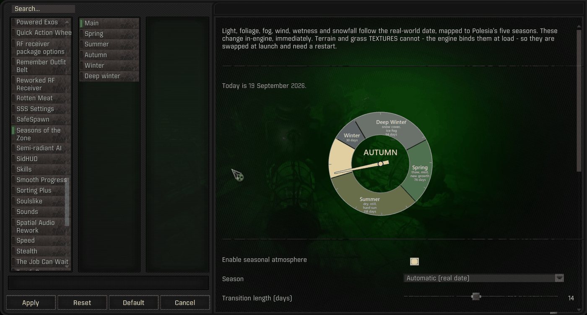
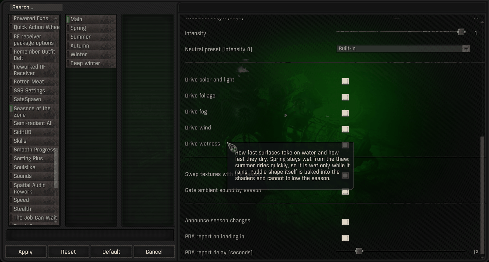
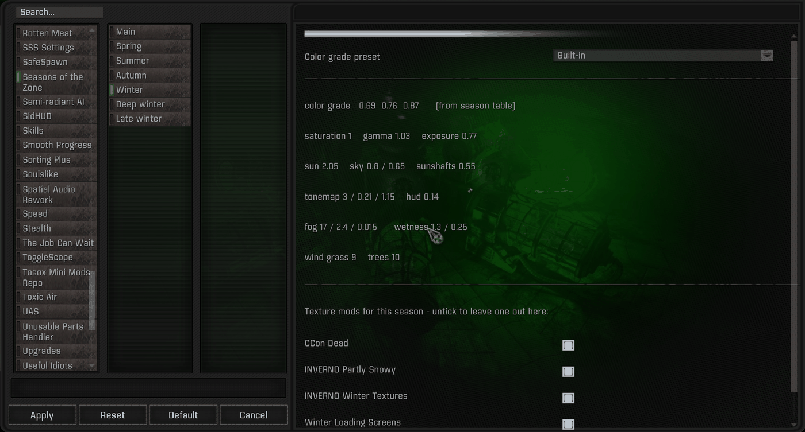
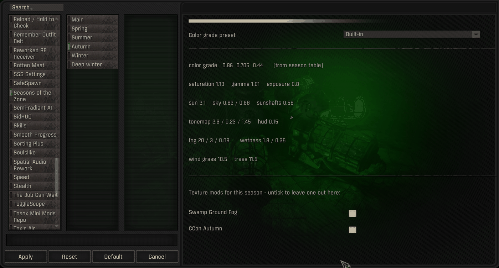
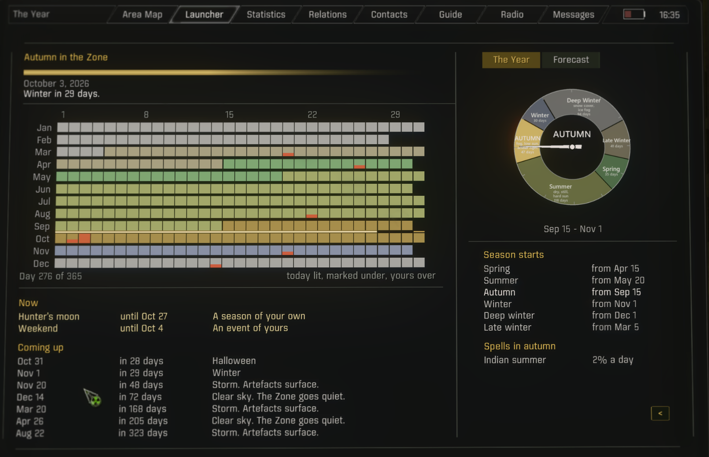
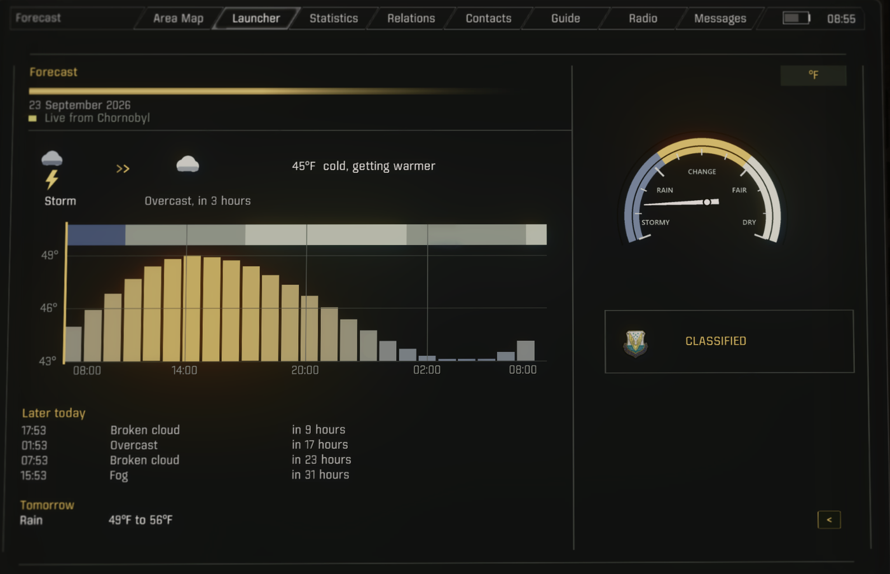
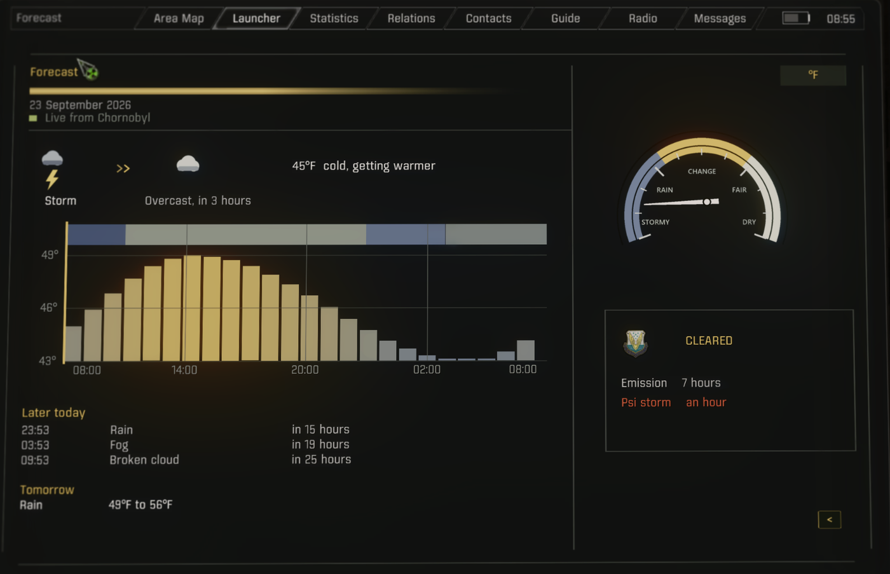
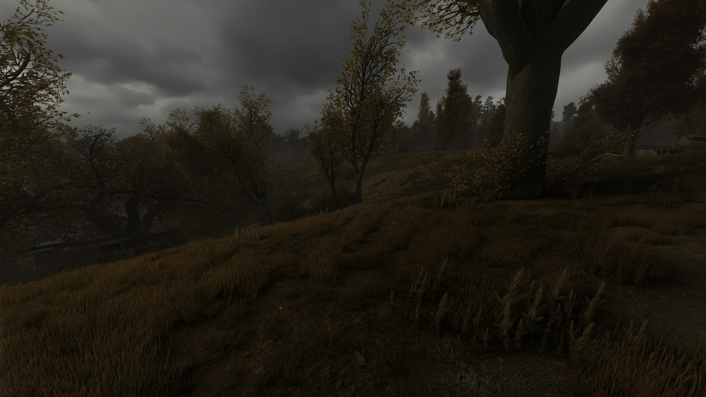
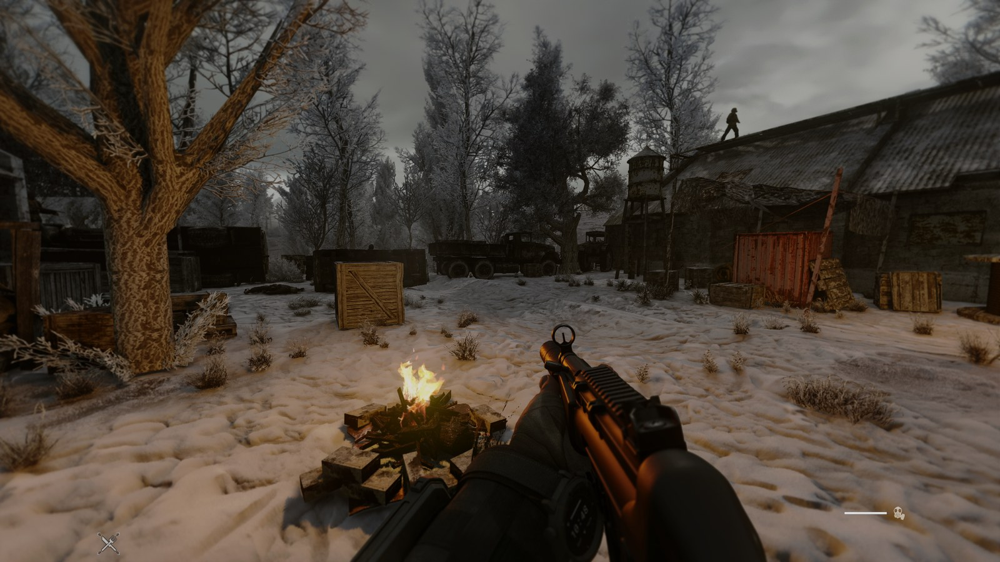

# The interface

Two surfaces. **MCM → Seasons of the Zone** is where the mod is configured: seven pages in
MCM's second column, Main and then one per season — Spring, Summer, Autumn, Winter, Deep
winter, Late winter. A calendar of your own, from `configure.bat`, leaves out the pages
of the seasons it turns off, and names of your own for the seasons title the pages and
fill the Season list. The **Seasons** app in the PDA is where it is read: one app with two faces, **The
Year** and **Forecast**. There is no HUD element, no pop-up and no key binding.

---

## Main

At the top, under the summary, two lines show what the PDA app needs:

- **Mod App Creator.** The Seasons app opens from its launcher, or with the key below. Red
  while it has no way in: Mod App Creator is missing, or another mod's PDA tabs have taken
  the place of its Launcher tab, and no key is set.
- **The weather scheduler.** The base game's, which GAMMA uses, or Atmospherics' day planner
  if you've installed it. This sets how far ahead the forecast can see; see [Forecast](#forecast--the-pda-page).
  Red only if there's no weather manager at all.

Under them, **Open the Seasons app** sets a key that opens the app in a window of its own,
outside the PDA. It is unset until you pick one; see [The Seasons app](#the-seasons-app).

The page opens with a short summary, today's date, and a dial of the year with the needle
on the current day. Each wedge is sized by the season's real length: summer is a third of
the year, autumn seven weeks.

The dial's colors are each season's own color grade, so it also shows what the game is
graded towards. It follows the calendar and ignores the pin below it. With a calendar of
your own the dial is redrawn for your dates; when it could not be drawn (that needs
Pillow, see [CONFIGURING.md](CONFIGURING.md#calendar)) it is left out.

Below the dial:

- **Enable seasonal atmosphere** — the master switch.
- **Season** — automatic, or pin one of the seasons your calendar has on. A pin drives
  everything: the seasonal atmosphere changes within five seconds, and the seasonal mods
  and soundscape follow the next time you start with `play.bat`, since it switches them
  before the game starts.
- **Roll the season at launch** and **Chance per launch (%)** — the dice. Each launch
  through `play.bat` draws 1 to 100; at or under the chance, another of the seasons your
  calendar has on, picked at random, runs until the next launch, in every layer and the
  seasonal mods alike. A pin is never rolled over. Off by default, at 25% when on. While a
  roll runs, a line above the dial says so: "Rolled winter for this launch - the calendar
  reads summer. The next launch through play.bat rolls again." See the README's
  [Rolling the season](../README.md#rolling-the-season).
- **Calendar runs on** — the real date, or the game's clock: the Zone keeps its own date,
  the in-game date sped up by **Zone days per game day** from the day the game starts. The
  game writes that date to `appdata\seasons_clock.txt` as it saves and loads, and
  `play.bat` switches the seasonal mods by it at the next launch. See the README's
  [The game's own clock](../README.md#the-games-own-clock).
- **Transition length (days)** — the blend window centered on each boundary. 0 switches on
  the date.
- **Intensity** — 0 is GAMMA's stock look, 1 the full season.
- **Neutral color grade preset (intensity 0)** — which color grade preset the neutral
  baseline uses.

Then one switch per layer — color and light, foliage, fog, wind, wetness — so a layer you
would rather tune yourself can be switched off on its own. **Weather odds follow the
season**, off by default, tips Atmospherics 2.69's odds for each sky by the season, blended
across a turn: more clear days and thunderstorms in summer, more rain and fog in autumn,
more overcast in the winters, more fog in the thaw. Your Atmospherics weights stay the base
it tips; the base game's weather has no odds to tip.

Below those are the two switches for what `play.bat` changes at launch, which can't
change mid-session. **Swap textures with the season** is the master switch for seasonal
mods and texture sets: off, `play.bat` disables every seasonal mod and leaves texture sets
as they are, and the seasonal atmosphere carries on. **Seasonal ambient sound** is the
soundscape's.

### Days

Six fixed dates sit on top of whatever season is running. None of them change the season:
April 26 is still spring, December 14 still deep winter.

Two are **remembrance days** — April 26, International Chernobyl Disaster Remembrance Day,
and December 14, Ukraine's Liquidators' Day. On these the Zone goes still.

- **Remembrance days: clear sky** — the sky is held clear all day.
- **Remembrance days: PDA messages** — an opening transmission shortly after you load in,
  then further lines at random intervals of eight to twenty minutes, drawn from that
  day's pool. The pool is shuffled rather than rolled, so nothing repeats until it is
  exhausted.

Four are **anniversaries** — the release dates of the mainline games: March 20, August 22,
October 2 and November 20. These pull the other way, and the Zone gets loud.

- **Anniversaries: PDA messages** — the same, opening with a line counting the years
  since that game's story, on the in-game clock, so the count never goes stale.
- **Anniversaries: the Zone gets loud** — the weather is pushed to storms all day.
- **Anniversaries: a crop of artefacts** — roughly zero to five on each level you
  visit that day, through Dynamic Anomalies Overhaul's own spawner. Lightly noticeable
  rather than a windfall. Unlike everything else here these persist in your save, exactly
  as ordinary spawned artifacts do, and only once per level per day even across reloads.
  Needs that mod; does nothing without it.

Every transmission is signed and carries that speaker's portrait — Barman, Sidorovich,
Owl, Beard, Sakharov, Forester, Nimble, or an unnamed guide — so the day arrives as people
talking rather than as the game narrating.

Last come the PDA message settings. **PDA notifications** turns every message the mod sends
to your PDA off, or on again, whatever the settings for each kind say; the **Silence** button
in the Seasons app is the same setting. A message sent while they are off is dropped, not
held for later. Then come the report on loading in and how long after loading it comes, and
**PDA messages as the season turns in play**. While you play, the day the seasons
run on can move on, always on the game's clock and past midnight on the real one; with this
on, your PDA says when the next season draws near and when it comes. With texture swapping
on, the second message adds that the ground follows at the next launch through `play.bat`.
A pinned or rolled season, or one a spell brings, has no turn to tell of. With the dice on,
the report on loading in never says when the next season begins: the next launch rolls
again.

Every option has hover text.

## A season page

Each season gets its own page, headed by a bar in that season's grade.

**Color grade preset** picks the `cfg_load` preset that season's color grade comes from:
Built-in (the mod's own grade for the season), the mod's own seven, then every other
preset in `appdata/` —
Atmospherics' Cold, Neutral and Warm, and any you have tuned yourself. Only the grade
changes; it takes effect on Apply.

Under it is a read-out of what that season actually resolves to — grade, saturation, gamma,
exposure, sun, tonemap, fog, wetness and wind — with the grade's source named in brackets,
either `from built-in values` or the preset you picked, by its name in the dropdown. It is
rebuilt each time the page is opened, so reopen it after Apply to see a preset take.

**Seasonal mods for this season** lists the seasonal mods on in that season, each with its
own checkbox. Unchecking one leaves it out of *that* season only — a mod used in every
winter can stay on for deep winter and off for the other two. The choice persists. Hover
text gives the mod's full span, file count and size. `play.bat` writes the list, so until
the first start with it the page asks for one instead.

A mod is listed on the page of every season it serves, so its name carries no season: on
the Autumn page above, *CCon Autumn* is the autumn set.

The mods shown are third-party texture packs (I.N.V.E.R.N.O, C Consciousness and others). None
of them are included in this mod.

## Your calendar

With seasons of your own, events, periods or spells made in `configure.bat`, MCM has one
more page after the seasons: a switch for each, under a heading for each kind, by the name
you gave it. On, which is the default, your PDA tells you when it is on as the game starts,
after the season's report, and when it begins while you play. A spell that brings its season
is already in that report, so it isn't told twice. `play.bat` writes the page's list and its
labels, and so does a save in `configure.bat`.

---

## The Seasons app

One tile in [Mod App Creator](https://www.moddb.com/mods/stalker-anomaly/addons/mod-app-creator)'s
launcher, showing the season the world runs, which a pin, the dice or a spell can make
another than the calendar's. It opens on The Year, and a switch at the top of the right
column moves between **The Year** and **Forecast**. The page you're on is lit. Both pages
wear the running season's accent bar.

The app also opens on a key you set on MCM's Main page (**Open the Seasons app**), in a window
of its own drawn in the 2D PDA's frame. The switch works the same, and Escape, the key again
or Back closes it. This way in needs no PDA tab and no Mod App Creator. The PDA's tab bar is
one file, `ui/pda_16.xml`, that Mod App Creator ships whole, and so do some mods that add
tabs of their own; only one copy is used, and the other's tabs are gone. If that takes
Mod App Creator's Launcher tab, MCM's Main page says so, and the key still opens the app.
With the 3D PDA on, the window is also sharper than the screen in hand.

At the foot of both pages, beside Back, **Silence** turns the mod's PDA messages off, and on
again. It is MCM's **PDA notifications** seen on the page, and it is lit while the messages
are off. Under it, a line names the mod, its version and its author, so a screenshot of the
app says which Seasons it shows.

## The Year — the calendar page

Dates and names. Anything running on the game clock lives on
[Forecast](#forecast--the-pda-page) instead.

It is read-only:

- **The header** — the season the world runs, and under the date, why: *Pinned.*, *By the
  dice.* or the spell and its last day, each followed by what the calendar reads. On a plain
  calendar day it says when the next season comes; with the dice on, that they roll again
  at the next launch instead, since the next season is no promise then.
- **The year grid** — twelve rows of day cells, one per month, tinted by the calendar's
  seasons. Today's cell is lit, the days the Zone marks are underlined, and your own
  seasons, dated events, periods and the spells on have a line in the gap above their days.
  A spell that brings its season tints its days that season's color. Weekly events, like
  every weekend, are in the lists rather than drawn.
- **Now** — what is on today beyond the season, each with its last day: your seasons,
  events, periods and spells, the kinds of weather `play.bat` found (freezing, thaw, heat),
  and a day the Zone marks. Four rows at most, the last saying how many more there are.
- **Coming up** — the next of everything, soonest first: the calendar's next turn (*by the
  calendar* when a pin, the dice or a spell has the season), the marked days, and the next
  day each of your own comes on.
- **Season starts** — the seasons from spring, your periods among them, and the date each
  begins, beside the dial, which stays the calendar's. The calendar's season is white.
- **Spells in** the season — the spells that can start today, with their chance a day.
  When one comes is never shown.

What is on glows: its rows in amber that swells to near white and back, its line on the grid
over a halo, a season another than the calendar's in the header and the year list. A day the
Zone marks alarms instead: its row and its cell pulse in red the way the forecast's emission
alert does. Today and the marked days are red, a color no season uses. Today fills its cell
and a marked day is underlined, so the two stay distinct when they fall on the same day. A
marked day says what MCM's switches leave it doing, and with all of them off it isn't marked.

Seasonal mods are listed on MCM's season pages, not here.

The dial and the accent bar are the mod's own textures, and nothing else on the page is an
image, so the page never logs *Can't find texture*.

---

## Forecast — the PDA page

What is about to happen, on the game clock. It fits on one screen with no scrolling.

### What it shows

**The sky, now and next.** Two weather icons with an arrow between them, when the change
comes, and how likely the forecast is to be right. The arrow only appears when a change is
coming.

**The barometer.** A face labeled STORMY / RAIN / CHANGE / FAIR / DRY, with the needle on the
current weather. The needle twitches every few seconds to show it's a live reading.

**The day chart.** The weather along the top and the temperature below it, with the clock hour
under each rule. Warm hours are amber, cold hours blue.

**Next 24 hours**, then **Tomorrow** — the coming changes with their times and chances, and
the next day's observed range.

### How far ahead it can see

It depends on the weather scheduler, which MCM's Main page names.

**The base game's**, which GAMMA uses, knows the current sky and roughly when it will change,
but picks the next sky
at random when the change happens. The page shows the current sky, the window for the
change, and under **Next sky** the chance of rain or storm, overcast or fog, and clear or
partly cloudy. Those odds are exact, taken from the scheduler's own list. The ribbon fades
out after the window.

**Atmospherics 2.69's day planner**, installed separately, plans the whole day. The page
forecasts it the way a forecaster would: times are rounded and can be off by an hour or two
a day ahead, about one call in ten is wrong, and both get better as the change gets closer.
The percentage beside each call is how often calls like it come true. **Exact weather
forecast** in MCM shows the plan as it will happen instead.

### Where the numbers come from

The weather is the game's; the temperature is the real world's. The temperature takes the
real day's high and low as its base - Chornobyl's, or a place picked on `configure.bat`'s
Weather step - and lets the in-game weather move it, so a storm reads colder than clear sky.
See [API.md](API.md#temperature) for details.

The source line under it says which: *Live from Chornobyl - weather data by
Open-Meteo.com*, or, without a reading, *No station data*, modeled on the place's own
climate. A small marker beside it pulses when the reading is live and stays dark when it's
modeled. The °C/°F button and the MCM option are the same setting.

### The ecologist forecast

Emissions are scheduled, and the ecologists measure them, so how much the page tells you
depends on your goodwill with them (`relation_registry.community_goodwill("ecolog", …)`,
1000 at friendly). MCM's **Forecast: whose network** can pick Clear Sky or UNISG instead,
who run instruments of their own, or **Best of the three**, which goes by whichever of
them thinks most of you. The panel wears that faction's shield, and the first time a
faction's network opens to you, its leader says so on the PDA: Sakharov, Lebedev or Major
Hernandez.

| Goodwill | | What the panel says |
|---|---|---|
| below 200 | **CLASSIFIED** | the faction's emblem and the word |
| 200 | **LIMITED** | a bracket — `ALL CLEAR` · `8 to 16 hours` · `2 to 8 hours` · `WITHIN 2 HOURS`, and *Rough warnings, never the hour* |
| 700 | **CLEARED** | the hour, and a red strobe under two hours |

Above, the psi storm is an hour out, so its line strobes; the emission, seven hours out, doesn't.

Both thresholds are MCM sliders; those are the defaults. Setting them to 0 and 50 shows the
middle tier without changing your goodwill.

The brackets are fixed hours, so they mean the same thing whatever the emission frequency is
set to.

Under two hours both LIMITED and CLEARED raise the same flag, published as `alert` on
`blowout()` for wearable devices; see [WEARABLE-DEVICES.md](WEARABLE-DEVICES.md). It's never
set at CLASSIFIED.

Emissions aren't on the calendar because there are too many of them: with GAMMA's defaults,
six to twelve per real day.

---

## In the Zone

Autumn: low amber sun, thinned canopy, the grade pulled towards yellow-brown.

Deep winter: snow cover, flat contrast, cold light, and the bare stems of the dead set
showing through. The PDA line carries no date because the season is pinned rather than
read from the calendar.

Both shots combine this mod's seasonal atmosphere with third-party texture mods it
switches for the season - C Consciousness' autumn set above, and its dead set under
Project I.N.V.E.R.N.O's snow below. The color, fog, wind and wetness are the mod; the ground and
foliage textures are their authors'.
